# 功能设计文档（FDD）

## 烟踪智治：基于行为证据链的公共场所烟头乱扔智能识别与环卫调度决策系统

| 字段 | 内容 |
|------|------|
| 文档版本 | v1.0 |
| 编写日期 | 2026-08-07 |
| 关联文档 | 烟踪智治-PRD文档.md v1.0 |
| 技术栈 | 后端 Python FastAPI / 前端 Vue3 |
| 部署级别 | 校园试点（2-4 路摄像头） |

---

## 目录

- [1. 文档概述](#1-文档概述)
- [2. 系统组件设计](#2-系统组件设计)
  - [2.1 组件依赖图](#21-组件依赖图)
  - [2.2 组件清单](#22-组件清单)
  - [2.3 后端目录结构](#23-后端目录结构)
  - [2.4 前端目录结构](#24-前端目录结构)
- [3. AI 算法管道功能设计](#3-ai-算法管道功能设计)
  - [3.1 视频流接入模块](#31-视频流接入模块)
  - [3.2 图像增强模块](#32-图像增强模块)
  - [3.3 YOLO 检测模块](#33-yolo-检测模块)
  - [3.4 三段式证据链状态机](#34-三段式证据链状态机)
  - [3.5 ByteTrack 跟踪与事件关联模块](#35-bytetrack-跟踪与事件关联模块)
  - [3.6 证据采集模块](#36-证据采集模块)
  - [3.7 AI 管道主流程](#37-ai-管道主流程)
- [4. 后端服务功能设计](#4-后端服务功能设计)
  - [4.1 认证与权限模块](#41-认证与权限模块)
  - [4.2 摄像头管理模块](#42-摄像头管理模块)
  - [4.3 事件接收与校验模块](#43-事件接收与校验模块)
  - [4.4 证据存储模块](#44-证据存储模块)
  - [4.5 工单管理模块](#45-工单管理模块)
  - [4.6 数据统计模块](#46-数据统计模块)
  - [4.7 决策引擎模块](#47-决策引擎模块)
  - [4.8 WebSocket 推送模块](#48-websocket-推送模块)
  - [4.9 审计日志模块](#49-审计日志模块)
- [5. 前端应用功能设计](#5-前端应用功能设计)
  - [5.1 实时监控大屏](#51-实时监控大屏)
  - [5.2 证据追溯面板](#52-证据追溯面板)
  - [5.3 决策驾驶舱](#53-决策驾驶舱)
  - [5.4 移动端小程序](#54-移动端小程序)
- [6. 数据模型设计](#6-数据模型设计)
  - [6.1 ER 图](#61-er-图)
  - [6.2 建表 SQL](#62-建表-sql)
- [7. 核心业务流程](#7-核心业务流程)
  - [7.1 违规事件全链路流程](#71-违规事件全链路流程)
  - [7.2 工单闭环流程](#72-工单闭环流程)
  - [7.3 调度建议生成流程](#73-调度建议生成流程)
  - [7.4 AI 参数动态调优流程](#74-ai-参数动态调优流程)
- [8. 关键时序图](#8-关键时序图)
  - [8.1 违规事件处理时序](#81-违规事件处理时序)
  - [8.2 工单推送与闭环时序](#82-工单推送与闭环时序)
  - [8.3 实时报警推送时序](#83-实时报警推送时序)
  - [8.4 视频流鉴权时序](#84-视频流鉴权时序)
- [9. 接口详细设计](#9-接口详细设计)
  - [9.1 认证接口](#91-认证接口)
  - [9.2 摄像头接口](#92-摄像头接口)
  - [9.3 事件接口](#93-事件接口)
  - [9.4 工单接口](#94-工单接口)
  - [9.5 决策接口](#95-决策接口)
  - [9.6 AI 控制接口](#96-ai-控制接口)
  - [9.7 用户接口](#97-用户接口)
- [10. 错误码设计](#10-错误码设计)

---

## 1. 文档概述

本文档基于《烟踪智治-PRD文档 v1.0》，对系统的每个功能模块进行详细设计，包括：

- 模块职责与边界
- 内部处理逻辑（伪代码/算法描述）
- 输入/输出规范
- 异常处理策略
- 组件间交互关系
- 核心业务流程图与时序图
- 接口级别的请求/响应规范

文档面向开发人员，可直接作为编码依据。

---

## 2. 系统组件设计

### 2.1 组件依赖图

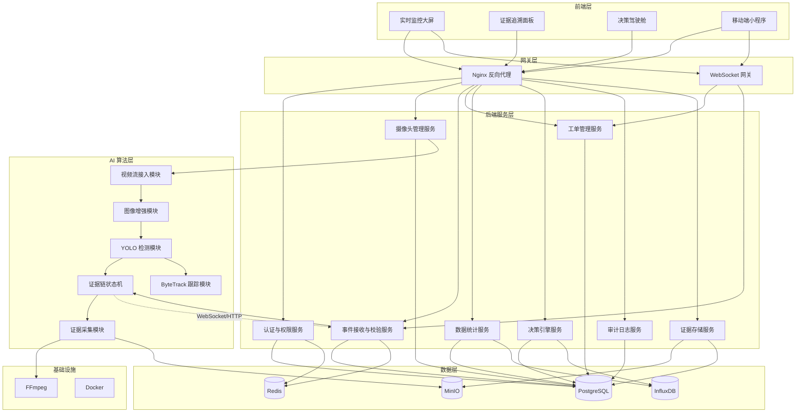

### 2.2 组件清单

| 层级 | 组件名 | 职责 | 关键依赖 |
|------|--------|------|----------|
| AI | 视频流接入模块 | RTSP 拉流、自适应抽帧、环形缓冲区管理 | FFmpeg, OpenCV |
| AI | 图像增强模块 | Retinex/直方图均衡化、暗光自适应 | OpenCV |
| AI | YOLO 检测模块 | 烟头小目标检测、手部检测 | PyTorch, YOLOv8 |
| AI | 证据链状态机 | 三段式时序验证、状态转换、事件输出 | - |
| AI | ByteTrack 跟踪模块 | 行人跟踪、事件关联、ReID | ByteTrack |
| AI | 证据采集模块 | 视频片段截取、关键帧提取、上传 MinIO | FFmpeg, MinIO SDK |
| 后端 | 认证与权限服务 | JWT 签发/验证、RBAC 鉴权 | PostgreSQL, Redis |
| 后端 | 摄像头管理服务 | CRUD、流健康检查、ROI 配置 | PostgreSQL |
| 后端 | 事件接收与校验服务 | 接收 AI 事件、证据链校验、去重 | PostgreSQL, Redis |
| 后端 | 证据存储服务 | 文件接收、MinIO 上传、路径管理 | MinIO, PostgreSQL |
| 后端 | 工单管理服务 | 工单生成、状态流转、超时处理 | PostgreSQL |
| 后端 | 数据统计服务 | 时序聚合、热力图计算、报表生成 | PostgreSQL, InfluxDB |
| 后端 | 决策引擎服务 | 调度规则引擎、建议生成、治理效果追踪 | PostgreSQL, InfluxDB |
| 后端 | 审计日志服务 | 操作日志记录、查询 | PostgreSQL |
| 前端 | 实时监控大屏 | 多路视频矩阵、AI 渲染、报警弹窗 | Vue3, ECharts, WebSocket |
| 前端 | 证据追溯面板 | 事件列表、视频回放、证据展示 | Vue3, Video.js |
| 前端 | 决策驾驶舱 | GIS 热力图、趋势图、建议卡片 | Vue3, ECharts, Leaflet |
| 前端 | 移动端小程序 | 工单接收、拍照闭环、巡查打卡 | 微信小程序 |

### 2.3 后端目录结构

```
backend/
├── app/
│   ├── __init__.py
│   ├── main.py                     # FastAPI 应用入口
│   ├── config.py                   # 配置加载（环境变量 + config.yaml）
│   ├── database.py                 # 数据库连接池（SQLAlchemy async）
│   ├── dependencies.py             # FastAPI 依赖注入（当前用户、权限检查）
│   ├── models/                     # SQLAlchemy ORM 模型
│   │   ├── __init__.py
│   │   ├── user.py
│   │   ├── camera.py
│   │   ├── event.py
│   │   ├── evidence.py
│   │   ├── workorder.py
│   │   ├── suggestion.py
│   │   └── audit_log.py
│   ├── schemas/                    # Pydantic 请求/响应模型
│   │   ├── __init__.py
│   │   ├── auth.py
│   │   ├── camera.py
│   │   ├── event.py
│   │   ├── workorder.py
│   │   ├── suggestion.py
│   │   └── common.py               # 分页、错误响应等通用模型
│   ├── api/                        # API 路由
│   │   ├── __init__.py
│   │   ├── router.py               # 路由聚合
│   │   ├── v1/
│   │   │   ├── __init__.py
│   │   │   ├── auth.py
│   │   │   ├── cameras.py
│   │   │   ├── events.py
│   │   │   ├── workorders.py
│   │   │   ├── suggestions.py
│   │   │   ├── dashboard.py
│   │   │   ├── users.py
│   │   │   └── audit.py
│   │   └── ai/
│   │       ├── __init__.py
│   │       ├── config.py
│   │       ├── preprocess.py
│   │       ├── metrics.py
│   │       └── events.py            # AI 事件接收端点
│   ├── services/                   # 业务逻辑层
│   │   ├── __init__.py
│   │   ├── auth_service.py
│   │   ├── camera_service.py
│   │   ├── event_service.py
│   │   ├── evidence_service.py
│   │   ├── workorder_service.py
│   │   ├── stats_service.py
│   │   ├── decision_service.py
│   │   └── audit_service.py
│   ├── core/                       # 核心组件
│   │   ├── __init__.py
│   │   ├── security.py             # JWT 生成/验证、密码哈希
│   │   ├── permissions.py          # RBAC 权限装饰器
│   │   ├── exceptions.py           # 自定义异常
│   │   ├── middleware.py           # 中间件（审计日志、限流、CORS）
│   │   └── minio_client.py         # MinIO 客户端封装
│   └── websocket/                  # WebSocket 管理
│       ├── __init__.py
│       ├── manager.py              # 连接管理器
│       └── channels.py             # 频道定义
├── worker/                         # 后台任务
│   ├── __init__.py
│   ├── scheduler.py                # 定时任务调度（APScheduler）
│   ├── stats_aggregator.py         # 时序数据聚合任务
│   ├── suggestion_generator.py     # 调度建议生成任务
│   └── workorder_timeout.py        # 工单超时检查任务
├── alembic/                        # 数据库迁移
├── tests/                          # 测试
├── requirements.txt
├── Dockerfile
└── docker-compose.yml
```

### 2.4 前端目录结构

```
frontend/
├── src/
│   ├── main.ts
│   ├── App.vue
│   ├── router/
│   │   └── index.ts
│   ├── stores/                     # Pinia 状态管理
│   │   ├── auth.ts
│   │   ├── camera.ts
│   │   ├── event.ts
│   │   └── websocket.ts
│   ├── api/                        # API 请求封装
│   │   ├── request.ts              # Axios 实例 + 拦截器
│   │   ├── auth.ts
│   │   ├── camera.ts
│   │   ├── event.ts
│   │   ├── workorder.ts
│   │   ├── suggestion.ts
│   │   └── dashboard.ts
│   ├── views/                      # 页面
│   │   ├── monitor/                # 实时监控大屏
│   │   │   ├── index.vue
│   │   │   ├── VideoMatrix.vue     # 多路视频矩阵
│   │   │   ├── AlertPopup.vue      # 报警弹窗
│   │   │   └── CameraStatus.vue    # 摄像头状态条
│   │   ├── trace/                  # 证据追溯面板
│   │   │   ├── index.vue
│   │   │   ├── EventList.vue       # 事件列表
│   │   │   ├── VideoPlayer.vue     # 视频回放
│   │   │   ├── EvidenceFrames.vue  # 三帧证据
│   │   │   ├── TrajectoryView.vue  # 轨迹可视化
│   │   │   └── TimelineView.vue    # 证据链时间轴
│   │   ├── dashboard/              # 决策驾驶舱
│   │   │   ├── index.vue
│   │   │   ├── HeatmapView.vue     # GIS 热力图
│   │   │   ├── TideChart.vue       # 时段潮汐图
│   │   │   ├── EffectCompare.vue   # 治理效果对比
│   │   │   ├── SuggestionCards.vue # 调度建议卡片
│   │   │   └── OverviewCards.vue   # 数据概览卡片
│   │   └── login/
│   │       └── index.vue
│   ├── components/                 # 公共组件
│   │   ├── layout/
│   │   └── common/
│   ├── composables/                # 组合式函数
│   │   ├── useWebSocket.ts
│   │   └── usePermission.ts
│   ├── utils/
│   │   ├── format.ts               # 时间/数字格式化
│   │   └── constants.ts
│   └── assets/
├── public/
├── vite.config.ts
├── tsconfig.json
├── Dockerfile
└── package.json
```

---

## 3. AI 算法管道功能设计

### 3.1 视频流接入模块

**模块职责：** 从摄像头拉取 RTSP 流，进行自适应抽帧，维护环形缓冲区。

#### 3.1.1 RTSP 拉流子模块

```python
class RTSPStreamManager:
    """管理单路 RTSP 流的生命周期"""

    def __init__(self, camera_id: str, rtsp_url: str, on_frame_callback):
        self.camera_id = camera_id
        self.rtsp_url = rtsp_url
        self.on_frame = on_frame_callback
        self.cap = None              # cv2.VideoCapture
        self.is_running = False
        self.reconnect_count = 0
        self.max_reconnect = 3
        self.reconnect_interval = 5  # 秒

    def connect(self) -> bool:
        """
        建立 RTSP 连接
        返回: True 成功, False 失败
        异常: 捕获 cv2.VideoCapture 异常，不向上抛出
        """
        # 使用 FFmpeg 后端以获得更好的 RTSP 兼容性
        self.cap = cv2.VideoCapture(self.rtsp_url, cv2.CAP_FFMPEG)
        self.cap.set(cv2.CAP_PROP_BUFFERSIZE, 1)  # 最小缓冲降低延迟
        if not self.cap.isOpened():
            return False
        self.is_running = True
        self.reconnect_count = 0
        return True

    def _reconnect(self):
        """断线重连：间隔 5 秒，最多 3 次"""
        while self.reconnect_count < self.max_reconnect:
            time.sleep(self.reconnect_interval)
            self.reconnect_count += 1
            if self.connect():
                return
        # 超过重连次数，标记摄像头离线
        self._notify_offline()

    def read_frame(self) -> Optional[np.ndarray]:
        """
        读取一帧画面
        返回: np.ndarray(BGR) 或 None（读取失败时触发重连）
        """
        ret, frame = self.cap.read()
        if not ret:
            self.is_running = False
            threading.Thread(target=self._reconnect, daemon=True).start()
            return None
        return frame

    def release(self):
        """释放资源"""
        self.is_running = False
        if self.cap:
            self.cap.release()
```

#### 3.1.2 自适应抽帧子模块

```python
class AdaptiveFrameSampler:
    """根据 GPU 负载动态调整抽帧频率"""

    def __init__(self, camera_id: str, default_fps: float = 25.0):
        self.camera_id = camera_id
        self.default_fps = default_fps
        self.current_fps = default_fps
        self.degraded_fps = 15.0
        self.last_sample_time = 0.0
        # 降频/恢复阈值
        self.degrade_gpu_threshold = 0.80   # GPU 显存占用
        self.degrade_queue_threshold = 60   # 推理队列长度
        self.recover_gpu_threshold = 0.60
        self.recover_queue_threshold = 20

    def should_sample(self, gpu_usage: float, queue_length: int) -> bool:
        """
        判断当前帧是否应该送入推理
        参数:
            gpu_usage: 当前 GPU 显存占用比例 (0.0-1.0)
            queue_length: 推理队列堆积帧数
        返回: True 采样, False 跳过
        """
        # 检查是否需要降频
        if (gpu_usage > self.degrade_gpu_threshold or
                queue_length > self.degrade_queue_threshold):
            if self.current_fps != self.degraded_fps:
                self.current_fps = self.degraded_fps
                logger.info(f"[{self.camera_id}] 降频至 {self.degraded_fps} FPS "
                           f"(GPU={gpu_usage:.0%}, Queue={queue_length})")

        # 检查是否可以恢复
        if (gpu_usage < self.recover_gpu_threshold and
                queue_length < self.recover_queue_threshold):
            if self.current_fps != self.default_fps:
                self.current_fps = self.default_fps
                logger.info(f"[{self.camera_id}] 恢复至 {self.default_fps} FPS")

        # 按当前 FPS 计算采样间隔
        interval = 1.0 / self.current_fps
        now = time.time()
        if now - self.last_sample_time >= interval:
            self.last_sample_time = now
            return True
        return False
```

#### 3.1.3 环形缓冲区子模块

```python
class CircularFrameBuffer:
    """
    环形视频缓冲区
    保留最近 N 秒的视频帧，用于违规事件触发时截取证据视频
    """

    def __init__(self, camera_id: str, retention_seconds: int = 30, fps: float = 25.0):
        self.camera_id = camera_id
        self.max_size = int(retention_seconds * fps)  # 30s * 25fps = 750 帧
        self.buffer = deque(maxlen=self.max_size)
        self.lock = threading.Lock()

    def push(self, frame: np.ndarray, timestamp: str):
        """写入一帧"""
        with self.lock:
            self.buffer.append({
                "frame": frame,
                "timestamp": timestamp
            })

    def extract_clip(self, before_seconds: int = 10, after_seconds: int = 10) -> list:
        """
        截取违规时刻前后 N 秒的帧序列
        返回: [{"frame": np.ndarray, "timestamp": str}, ...]
        注意: after_seconds 部分可能因缓冲区尚未填满而不足
        """
        with self.lock:
            total = len(self.buffer)
            clip_size = int((before_seconds + after_seconds) * 25)
            # 从缓冲区末尾向前取
            start = max(0, total - clip_size)
            return list(self.buffer)[start:]
```

### 3.2 图像增强模块

**模块职责：** 对暗光画面进行增强处理，提升夜间检出率。

```python
class ImageEnhancer:
    """图像增强模块，支持 Retinex 和直方图均衡化"""

    def __init__(self):
        self.enabled = {}      # {camera_id: bool}
        self.algorithm = {}    # {camera_id: "retinex" | "histogram_eq"}
        self.auto_mode = {}    # {camera_id: bool}
        self.brightness_threshold = 50.0  # 低于此值自动启用

    def configure(self, camera_id: str, enabled: bool,
                  algorithm: str = "retinex", auto_mode: bool = False):
        """动态配置增强参数（由 /ai/preprocess/toggle 调用）"""
        self.enabled[camera_id] = enabled
        self.algorithm[camera_id] = algorithm
        self.auto_mode[camera_id] = auto_mode

    def process(self, camera_id: str, frame: np.ndarray) -> np.ndarray:
        """
        对帧进行增强处理
        参数:
            camera_id: 摄像头 ID
            frame: BGR 格式图像
        返回: 增强后的 BGR 图像（如未启用则原样返回）
        """
        if not self.enabled.get(camera_id, False):
            # 自动模式：检查亮度
            if self.auto_mode.get(camera_id, False):
                brightness = self._calc_brightness(frame)
                if brightness < self.brightness_threshold:
                    return self._apply_algorithm(
                        frame, self.algorithm.get(camera_id, "retinex"))
            return frame

        return self._apply_algorithm(
            frame, self.algorithm.get(camera_id, "retinex"))

    def _calc_brightness(self, frame: np.ndarray) -> float:
        """计算画面平均亮度（Y通道均值）"""
        gray = cv2.cvtColor(frame, cv2.COLOR_BGR2GRAY)
        return float(np.mean(gray))

    def _apply_algorithm(self, frame: np.ndarray, algorithm: str) -> np.ndarray:
        if algorithm == "retinex":
            return self._retinex(frame)
        elif algorithm == "histogram_eq":
            return self._histogram_eq(frame)
        return frame

    def _retinex(self, frame: np.ndarray) -> np.ndarray:
        """单尺度 Retinex (SSR) 算法"""
        # 转换到对数域
        frame_float = frame.astype(np.float64) + 1.0
        # 高斯模糊（sigma=80）
        blur = cv2.GaussianBlur(frame_float, (0, 0), sigmaX=80)
        # Retinex: log(I) - log(I_blur)
        result = np.log(frame_float) - np.log(blur)
        # 归一化到 0-255
        result = cv2.normalize(result, None, 0, 255, cv2.NORM_MINMAX)
        return result.astype(np.uint8)

    def _histogram_eq(self, frame: np.ndarray) -> np.ndarray:
        """CLAHE 自适应直方图均衡化"""
        lab = cv2.cvtColor(frame, cv2.COLOR_BGR2LAB)
        clahe = cv2.createCLAHE(clipLimit=2.0, tileGridSize=(8, 8))
        lab[:, :, 0] = clahe.apply(lab[:, :, 0])
        return cv2.cvtColor(lab, cv2.COLOR_LAB2BGR)
```

### 3.3 YOLO 检测模块

**模块职责：** 使用改进 YOLO 模型检测画面中的烟头目标和手部区域。

```python
class CigaretteDetector:
    """改进 YOLO 烟头检测器"""

    def __init__(self, model_path: str, device: str = "cuda:0"):
        self.model = YOLO(model_path)  # 加载改进后的 YOLOv8 权重
        self.device = device
        self.confidence_threshold = 0.75  # 可被 /ai/config 动态调整
        self.classes = {0: "cigarette", 1: "hand"}

    def detect(self, frame: np.ndarray, roi_polygon: list = None) -> list:
        """
        检测画面中的烟头和手部
        参数:
            frame: BGR 图像
            roi_polygon: ROI 多边形顶点 [(x,y), ...]，None 表示全画面
        返回: [
            {
                "class": "cigarette",
                "confidence": 0.92,
                "bbox": [x, y, w, h]  # 左上角坐标 + 宽高
            },
            ...
        ]
        """
        # 1. 如果有 ROI，裁剪画面
        search_frame = frame
        offset = (0, 0)
        if roi_polygon:
            search_frame, offset = self._apply_roi(frame, roi_polygon)

        # 2. YOLO 推理
        results = self.model(search_frame, conf=self.confidence_threshold,
                            device=self.device, verbose=False)

        # 3. 解析结果，坐标还原到原图
        detections = []
        for r in results:
            for box in r.boxes:
                x1, y1, x2, y2 = box.xyxy[0].tolist()
                cls = int(box.cls[0])
                conf = float(box.conf[0])
                detections.append({
                    "class": self.classes.get(cls, "unknown"),
                    "confidence": conf,
                    "bbox": [
                        int(x1 + offset[0]),
                        int(y1 + offset[1]),
                        int(x2 - x1),
                        int(y2 - y1)
                    ]
                })
        return detections

    def update_threshold(self, threshold: float):
        """动态更新置信度阈值"""
        self.confidence_threshold = threshold

    def _apply_roi(self, frame, polygon):
        """裁剪到 ROI 区域，返回裁剪后的图像和偏移量"""
        mask = np.zeros(frame.shape[:2], dtype=np.uint8)
        pts = np.array(polygon, dtype=np.int32)
        cv2.fillPoly(mask, [pts], 255)
        masked = cv2.bitwise_and(frame, frame, mask=mask)
        x_min = min(p[0] for p in polygon)
        y_min = min(p[1] for p in polygon)
        return masked, (x_min, y_min)
```

### 3.4 三段式证据链状态机

**模块职责：** 管理"持烟→抛掷→落地"三段式状态转换，只有三阶段依次触发才输出违规事件。

#### 3.4.1 状态机定义

```python
from enum import Enum
from dataclasses import dataclass, field
from datetime import datetime

class EventStage(Enum):
    IDLE = "IDLE"
    HOLDING = "HOLDING"
    THROWING = "THROWING"
    LANDED = "LANDED"
    CONFIRMED = "CONFIRMED"

@dataclass
class StateMachineConfig:
    """状态机参数，可被 /ai/config 动态调整"""
    holding_iou_threshold: float = 0.3        # 持烟 IoU 阈值
    holding_min_frames: int = 5               # 持烟最少持续帧数
    holding_timeout_sec: float = 10.0         # 持烟超时（未进入抛掷则回退）
    throwing_velocity_threshold: float = 50.0 # 抛掷速度阈值（像素/秒）
    throwing_trajectory_fit_threshold: float = 0.85  # 抛物线拟合 R² 阈值
    throwing_timeout_sec: float = 2.0         # 抛掷超时（未落地则回退）
    landed_min_static_frames: int = 30        # 落地静止最少帧数
    landed_y_ratio: float = 0.7              # 落地区域 y 坐标占画面高度比例

@dataclass
class TrackContext:
    """单个 track_id 的状态机上下文"""
    track_id: int
    stage: EventStage = EventStage.IDLE
    holding_frame_count: int = 0
    holding_best_frame: dict = None     # IoU 最大的持烟帧
    throwing_velocity_peak: float = 0.0
    throwing_best_frame: dict = None    # 速度突变最大的帧
    trajectory_points: list = field(default_factory=list)  # [[x, y, t], ...]
    stage_enter_time: datetime = None
    landed_static_count: int = 0
    landed_best_frame: dict = None      # 落地后首帧
```

#### 3.4.2 状态机核心逻辑

```python
class EvidenceChainStateMachine:
    """
    三段式行为证据链状态机
    每个 track_id 维护独立的状态机实例
    """

    def __init__(self, config: StateMachineConfig):
        self.config = config
        self.contexts = {}  # {track_id: TrackContext}

    def process_frame(self, track_id: int, detections: list,
                      frame: np.ndarray, timestamp: str,
                      optical_flow_result: dict = None) -> Optional[dict]:
        """
        处理一帧检测结果，推进状态机
        参数:
            track_id: 行人轨迹 ID
            detections: 该帧的检测结果列表
            frame: 原始画面
            timestamp: 帧时间戳
            optical_flow_result: 光流法分析结果 {velocity, direction}
        返回:
            当进入 CONFIRMED 阶段时返回事件 JSON，否则返回 None
        """
        ctx = self._get_or_create_context(track_id)
        cigarette = self._find_cigarette(detections)
        hand = self._find_hand(detections)

        # 状态超时检查
        if self._check_timeout(ctx):
            self._reset_to_idle(track_id)
            return None

        if ctx.stage == EventStage.IDLE:
            return self._handle_idle(ctx, cigarette, hand, frame, timestamp)

        elif ctx.stage == EventStage.HOLDING:
            return self._handle_holding(ctx, cigarette, hand, frame,
                                        timestamp, optical_flow_result)

        elif ctx.stage == EventStage.THROWING:
            return self._handle_throwing(ctx, cigarette, frame,
                                         timestamp, optical_flow_result)

        elif ctx.stage == EventStage.LANDED:
            return self._handle_landed(ctx, cigarette, frame, timestamp)

        return None

    def _handle_idle(self, ctx, cigarette, hand, frame, timestamp):
        """IDLE 状态：检测是否开始持烟"""
        if cigarette and hand:
            iou = self._calc_iou(cigarette["bbox"], hand["bbox"])
            if iou > self.config.holding_iou_threshold:
                ctx.stage = EventStage.HOLDING
                ctx.holding_frame_count = 1
                ctx.stage_enter_time = datetime.now()
                ctx.holding_best_frame = {
                    "frame": frame.copy(), "timestamp": timestamp, "iou": iou}
                # 记录轨迹起点
                cx, cy = self._bbox_center(cigarette["bbox"])
                ctx.trajectory_points.append([cx, cy, timestamp])
        return None

    def _handle_holding(self, ctx, cigarette, hand, frame,
                        timestamp, optical_flow_result):
        """HOLDING 状态：持续验证持烟，检测抛掷动作"""
        if cigarette and hand:
            iou = self._calc_iou(cigarette["bbox"], hand["bbox"])
            if iou > self.config.holding_iou_threshold:
                ctx.holding_frame_count += 1
                # 更新最佳持烟帧
                if iou > ctx.holding_best_frame.get("iou", 0):
                    ctx.holding_best_frame = {
                        "frame": frame.copy(), "timestamp": timestamp, "iou": iou}
                # 记录轨迹
                cx, cy = self._bbox_center(cigarette["bbox"])
                ctx.trajectory_points.append([cx, cy, timestamp])

                # 检查是否满足持烟最小帧数
                if ctx.holding_frame_count >= self.config.holding_min_frames:
                    # 检查是否触发抛掷动作
                    if optical_flow_result:
                        if self._check_throwing_action(
                                ctx, optical_flow_result, cigarette, timestamp):
                            ctx.stage = EventStage.THROWING
                            ctx.stage_enter_time = datetime.now()
                            ctx.throwing_best_frame = {
                                "frame": frame.copy(), "timestamp": timestamp,
                                "velocity": optical_flow_result["velocity"]}
        else:
            # 烟头或手丢失，回退
            ctx.holding_frame_count = max(0, ctx.holding_frame_count - 1)
        return None

    def _handle_throwing(self, ctx, cigarette, frame, timestamp, optical_flow):
        """THROWING 状态：检测烟头落地"""
        if cigarette:
            cx, cy = self._bbox_center(cigarette["bbox"])
            ctx.trajectory_points.append([cx, cy, timestamp])

            # 检查是否在画面下方区域（地面附近）
            frame_h = frame.shape[0]
            if cy > frame_h * self.config.landed_y_ratio:
                # 检查是否静止
                if self._is_static(ctx, cigarette):
                    ctx.landed_static_count += 1
                    if ctx.landed_static_count == 1:
                        ctx.landed_best_frame = {
                            "frame": frame.copy(), "timestamp": timestamp}
                    if ctx.landed_static_count >= self.config.landed_min_static_frames:
                        ctx.stage = EventStage.LANDED
                        # 立即进入 CONFIRMED
                        return self._generate_event(ctx)
                else:
                    ctx.landed_static_count = 0
        return None

    def _handle_landed(self, ctx, cigarette, frame, timestamp):
        """LANDED 状态：直接进入 CONFIRMED"""
        return self._generate_event(ctx)

    def _check_throwing_action(self, ctx, optical_flow, cigarette, timestamp):
        """
        抛掷动作双重验证
        1. 光流法速度突变检测
        2. 抛物线轨迹拟合
        两个条件同时满足才判定为抛掷
        """
        # 条件1: 速度突变
        velocity = optical_flow.get("velocity", 0)
        direction = optical_flow.get("direction", 0)
        if velocity < self.config.throwing_velocity_threshold:
            return False
        # 速度方向应与重力方向一致（向下偏右或偏左）
        if not (0.5 < direction < 2.5):  # 弧度，约 30°-143°
            return False
        ctx.throwing_velocity_peak = velocity

        # 条件2: 抛物线轨迹拟合
        if len(ctx.trajectory_points) < 5:
            return False
        r_squared = self._fit_parabola(ctx.trajectory_points)
        if r_squared < self.config.throwing_trajectory_fit_threshold:
            return False

        return True

    def _fit_parabola(self, points: list) -> float:
        """
        对轨迹点进行抛物线拟合 y = ax² + bx + c
        返回: R² 拟合优度
        """
        xs = np.array([p[0] for p in points])
        ys = np.array([p[1] for p in points])
        # 二次多项式拟合
        coeffs = np.polyfit(xs, ys, 2)
        poly = np.poly1d(coeffs)
        y_pred = poly(xs)
        ss_res = np.sum((ys - y_pred) ** 2)
        ss_tot = np.sum((ys - np.mean(ys)) ** 2)
        r_squared = 1 - ss_res / (ss_tot + 1e-10)
        return float(r_squared)

    def _generate_event(self, ctx: TrackContext) -> dict:
        """生成违规事件 JSON"""
        event = {
            "event_id": str(uuid.uuid4()),
            "timestamp": datetime.now().isoformat(),
            "camera_id": None,  # 由上层填充
            "track_id": ctx.track_id,
            "stage": "THROW_CONFIRMED",
            "confidence": self._calc_overall_confidence(ctx),
            "bbox": None,  # 由上层填充当前帧 bbox
            "trajectory": ctx.trajectory_points[-20:],  # 最近20帧轨迹
            "evidence_frames": [
                {"frame_ts": ctx.holding_best_frame["timestamp"],
                 "type": "holding", "path": None},
                {"frame_ts": ctx.throwing_best_frame["timestamp"],
                 "type": "throwing", "path": None},
                {"frame_ts": ctx.landed_best_frame["timestamp"],
                 "type": "landed", "path": None},
            ],
            "video_clip_path": None  # 由证据采集模块填充
        }
        # 重置状态机
        self._reset_to_idle(ctx.track_id)
        return event

    def _calc_overall_confidence(self, ctx: TrackContext) -> float:
        """综合置信度：持烟持续帧数 + 抛掷速度 + 拟合优度"""
        holding_score = min(1.0, ctx.holding_frame_count / 10.0)
        velocity_score = min(1.0, ctx.throwing_velocity_peak / 100.0)
        return round((holding_score * 0.4 + velocity_score * 0.6), 3)

    def _calc_iou(self, box1: list, box2: list) -> float:
        """计算两个 bbox 的 IoU"""
        x1 = max(box1[0], box2[0])
        y1 = max(box1[1], box2[1])
        x2 = min(box1[0] + box1[2], box2[0] + box2[2])
        y2 = min(box1[1] + box1[3], box2[1] + box2[3])
        if x2 <= x1 or y2 <= y1:
            return 0.0
        inter = (x2 - x1) * (y2 - y1)
        area1 = box1[2] * box1[3]
        area2 = box2[2] * box2[3]
        return inter / (area1 + area2 - inter + 1e-10)

    def _bbox_center(self, bbox: list) -> tuple:
        return (bbox[0] + bbox[2] // 2, bbox[1] + bbox[3] // 2)

    def _is_static(self, ctx, cigarette) -> bool:
        """检查烟头是否静止（最近3帧位移小于阈值）"""
        if len(ctx.trajectory_points) < 3:
            return False
        recent = ctx.trajectory_points[-3:]
        max_dist = max(
            ((recent[i][0] - recent[i-1][0]) ** 2 +
             (recent[i][1] - recent[i-1][1]) ** 2) ** 0.5
            for i in range(1, len(recent))
        )
        return max_dist < 3.0  # 像素

    def _check_timeout(self, ctx: TrackContext) -> bool:
        """检查当前状态是否超时"""
        if ctx.stage == EventStage.IDLE:
            return False
        elapsed = (datetime.now() - ctx.stage_enter_time).total_seconds()
        if ctx.stage == EventStage.HOLDING:
            return elapsed > self.config.holding_timeout_sec
        elif ctx.stage == EventStage.THROWING:
            return elapsed > self.config.throwing_timeout_sec
        return False

    def _reset_to_idle(self, track_id: int):
        """重置状态机到 IDLE"""
        if track_id in self.contexts:
            self.contexts[track_id] = TrackContext(track_id=track_id)

    def _get_or_create_context(self, track_id: int) -> TrackContext:
        if track_id not in self.contexts:
            self.contexts[track_id] = TrackContext(track_id=track_id)
        return self.contexts[track_id]

    def _find_cigarette(self, detections: list) -> dict:
        for d in detections:
            if d["class"] == "cigarette":
                return d
        return None

    def _find_hand(self, detections: list) -> dict:
        for d in detections:
            if d["class"] == "hand":
                return d
        return None
```

### 3.5 ByteTrack 跟踪与事件关联模块

**模块职责：** 对画面中所有行人进行实时跟踪，并在抛掷事件触发时将事件绑定到具体行人。

```python
class TrackAndAssociate:
    """ByteTrack 行人跟踪 + 事件关联"""

    def __init__(self):
        self.tracker = ByteTracker()
        self.reid_model = ReIDModel()  # 行人重识别模型
        self.active_tracks = {}  # {track_id: {"bbox": [...], "hand_bbox": [...], "trajectory": [...]}}

    def update(self, detections: list, frame: np.ndarray) -> dict:
        """
        更新跟踪状态
        参数:
            detections: YOLO 检测结果（仅行人）
            frame: 当前帧
        返回: {track_id: {"bbox": [...], "hand_bbox": [...], "center": [x, y]}}
        """
        # 仅取行人检测结果送入 ByteTrack
        person_dets = [d for d in detections if d["class"] == "person"]
        tracked_objects = self.tracker.update(person_dets, frame)

        # 更新活跃跟踪列表
        for obj in tracked_objects:
            tid = obj["track_id"]
            hand_bbox = self._estimate_hand_bbox(obj["bbox"])
            self.active_tracks[tid] = {
                "bbox": obj["bbox"],
                "hand_bbox": hand_bbox,
                "center": self._bbox_center(obj["bbox"]),
                "last_seen": time.time()
            }

        # 清理超时跟踪（超过 5 秒未更新）
        now = time.time()
        expired = [tid for tid, info in self.active_tracks.items()
                   if now - info["last_seen"] > 5.0]
        for tid in expired:
            del self.active_tracks[tid]

        return self.active_tracks

    def associate_event(self, throw_origin: list, throw_time: str,
                        cigarette_trajectory: list) -> Optional[int]:
        """
        双重匹配策略：将抛掷事件关联到具体行人
        参数:
            throw_origin: 抛掷起点 [x, y]
            throw_time: 抛掷时间戳
            cigarette_trajectory: 烟头轨迹 [[x, y, t], ...]
        返回: 关联到的 track_id，未关联返回 None
        """
        # Step 1: 空间匹配 - 计算抛掷起点与各行人手部框的距离
        candidates = []
        for tid, info in self.active_tracks.items():
            hand_center = self._bbox_center(info["hand_bbox"])
            dist = ((throw_origin[0] - hand_center[0]) ** 2 +
                    (throw_origin[1] - hand_center[1]) ** 2) ** 0.5
            if dist < 100:  # d_threshold = 100 像素
                candidates.append((tid, dist, info))

        if not candidates:
            return None

        # Step 2: 时间窗口匹配 - 检查手部轨迹与烟头轨迹的时空重合
        best_tid = None
        best_score = 0
        for tid, dist, info in candidates:
            score = self._calc_temporal_overlap(
                info, cigarette_trajectory, throw_time)
            # 距离越近分数越高
            score *= (1 - dist / 100)
            if score > best_score:
                best_score = score
                best_tid = tid

        return best_tid if best_score > 0.3 else None

    def _calc_temporal_overlap(self, track_info, cig_trajectory, throw_time):
        """计算时间窗口内手部轨迹与烟头轨迹的空间重合度"""
        # 简化实现：检查在 throw_time 前后 1 秒内手部位置与烟头位置的最近距离
        # 实际实现中会使用 ReID 特征进行更精确的匹配
        return 0.5  # 简化返回

    def _estimate_hand_bbox(self, person_bbox):
        """从行人框估算手部区域（上方 1/3 区域）"""
        x, y, w, h = person_bbox
        return [x + w // 4, y, w // 2, h // 3]

    def _bbox_center(self, bbox):
        return (bbox[0] + bbox[2] // 2, bbox[1] + bbox[3] // 2)
```

### 3.6 证据采集模块

**模块职责：** 当状态机进入 CONFIRMED 阶段时，截取视频片段和关键帧，上传至 MinIO。

```python
class EvidenceCollector:
    """证据采集与存储模块"""

    def __init__(self, minio_client, frame_buffer: CircularFrameBuffer):
        self.minio = minio_client
        self.frame_buffer = frame_buffer
        self.bucket_name = "evidence"

    def collect(self, camera_id: str, event: dict,
                state_machine: EvidenceChainStateMachine) -> dict:
        """
        采集证据并上传
        参数:
            camera_id: 摄像头 ID
            event: 状态机生成的事件 JSON
            state_machine: 状态机实例（用于获取关键帧）
        返回: 更新后的事件 JSON（填充 evidence_frames 路径和 video_clip_path）
        """
        ctx = state_machine.contexts.get(event["track_id"])
        event_id = event["event_id"]

        # 1. 保存 3 张关键帧
        frame_map = {
            "holding": ctx.holding_best_frame,
            "throwing": ctx.throwing_best_frame,
            "landed": ctx.landed_best_frame,
        }
        for i, ef in enumerate(event["evidence_frames"]):
            frame_data = frame_map.get(ef["type"])
            if frame_data:
                object_name = f"{camera_id}_{event_id}_{ef['type'][0]}.jpg"
                # 编码为 JPEG
                _, img_bytes = cv2.imencode(".jpg", frame_data["frame"])
                self.minio.put_object(
                    self.bucket_name, object_name,
                    img_bytes.tobytes(), len(img_bytes),
                    content_type="image/jpeg")
                event["evidence_frames"][i]["path"] = f"/evidence/{object_name}"

        # 2. 截取视频片段
        frames = self.frame_buffer.extract_clip(before_seconds=10, after_seconds=10)
        if frames:
            clip_name = f"{camera_id}_{event_id}_clip.mp4"
            clip_path = f"/tmp/{clip_name}"
            self._encode_video(frames, clip_path)
            # 上传至 MinIO
            with open(clip_path, "rb") as f:
                self.minio.put_object(
                    self.bucket_name, clip_name, f,
                    os.path.getsize(clip_path),
                    content_type="video/mp4")
            event["video_clip_path"] = f"/evidence/{clip_name}"
            os.remove(clip_path)  # 清理临时文件

        return event

    def _encode_video(self, frames: list, output_path: str):
        """将帧序列编码为 MP4 视频"""
        h, w = frames[0]["frame"].shape[:2]
        fourcc = cv2.VideoWriter_fourcc(*"mp4v")
        writer = cv2.VideoWriter(output_path, fourcc, 25.0, (w, h))
        for f in frames:
            writer.write(f["frame"])
        writer.release()
```

### 3.7 AI 管道主流程

```mermaid
flowchart TD
    A[启动 AI 管道] --> B[加载配置与模型]
    B --> C[为每路摄像头创建 StreamManager]
    C --> D[启动拉流线程]

    D --> E{读取帧}
    E -->|失败| F[触发重连]
    F -->|重连成功| E
    F -->|重连失败| G[标记离线 告警]

    E -->|成功| H[写入环形缓冲区]
    H --> I[自适应抽帧判断]
    I -->|跳过| E
    I -->|采样| J[图像增强处理]

    J --> K[YOLO 检测]
    K --> L[ByteTrack 行人跟踪]
    L --> M[光流法分析烟头运动]

    M --> N[证据链状态机推进]
    N -->{状态}
    N -->|IDLE→HOLDING| O[记录持烟帧]
    N -->|HOLDING→THROWING| P[记录抛掷帧]
    N -->|THROWING→LANDED| Q[记录落地帧]
    N -->|CONFIRMED| R[证据采集模块]

    O --> E
    P --> E
    Q --> E

    R --> S[截取视频片段]
    S --> T[上传 3 帧证据至 MinIO]
    T --> U[上传视频片段至 MinIO]
    U --> V[生成事件 JSON]
    V --> W[推送事件至后端 WebSocket]
    W --> X[重置状态机]
    X --> E

    N -->|超时回退| Y[重置到 IDLE]
    Y --> E
```

---

## 4. 后端服务功能设计

### 4.1 认证与权限模块

**模块职责：** 用户认证（JWT）、角色权限控制（RBAC）、Token 管理。

#### 4.1.1 JWT 认证流程

```python
class AuthService:
    def __init__(self, secret_key: str, redis_client):
        self.secret_key = secret_key
        self.algorithm = "HS256"
        self.access_token_expire = timedelta(hours=2)
        self.refresh_token_expire = timedelta(days=7)
        self.redis = redis_client

    def login(self, username: str, password: str) -> dict:
        """
        用户登录
        返回: {"access_token": "...", "refresh_token": "...", "token_type": "bearer"}
        异常: InvalidCredentialsError 用户名或密码错误
        """
        user = self.user_repo.get_by_username(username)
        if not user or not self._verify_password(password, user.password_hash):
            raise InvalidCredentialsError("用户名或密码错误")
        if user.status != "active":
            raise AccountDisabledError("账户已禁用")

        access_token = self._create_token(
            {"sub": str(user.id), "role": user.role, "type": "access"},
            self.access_token_expire)
        refresh_token = self._create_token(
            {"sub": str(user.id), "type": "refresh"},
            self.refresh_token_expire)

        # 缓存 refresh_token 用于主动吊销
        self.redis.setex(
            f"refresh:{user.id}",
            int(self.refresh_token_expire.total_seconds()),
            refresh_token)

        return {
            "access_token": access_token,
            "refresh_token": refresh_token,
            "token_type": "bearer",
            "expires_in": int(self.access_token_expire.total_seconds())
        }

    def verify_token(self, token: str) -> dict:
        """
        验证 Access Token
        返回: {"user_id": int, "role": str}
        异常: TokenExpiredError, TokenInvalidError
        """
        try:
            payload = jwt.decode(token, self.secret_key, algorithms=[self.algorithm])
            if payload.get("type") != "access":
                raise TokenInvalidError("Token 类型错误")
            return {"user_id": int(payload["sub"]), "role": payload["role"]}
        except jwt.ExpiredSignatureError:
            raise TokenExpiredError("Token 已过期")
        except jwt.InvalidTokenError:
            raise TokenInvalidError("Token 无效")

    def refresh_token(self, refresh_token: str) -> dict:
        """
        刷新 Token
        异常: TokenInvalidError, TokenExpiredError
        """
        payload = jwt.decode(refresh_token, self.secret_key,
                            algorithms=[self.algorithm])
        if payload.get("type") != "refresh":
            raise TokenInvalidError("Token 类型错误")
        user_id = payload["sub"]
        # 检查 refresh_token 是否在 Redis 中（未被吊销）
        cached = self.redis.get(f"refresh:{user_id}")
        if not cached or cached != refresh_token:
            raise TokenInvalidError("Refresh Token 已失效")
        user = self.user_repo.get_by_id(user_id)
        return self.login(user.username, user.password_hash)
```

#### 4.1.2 RBAC 权限控制

```python
# 权限矩阵
PERMISSION_MATRIX = {
    "admin": {
        "cameras": ["read", "write", "delete"],
        "events": ["read", "write", "delete"],
        "workorders": ["read", "write", "delete"],
        "suggestions": ["read", "write", "feedback"],
        "users": ["read", "write", "delete"],
        "audit": ["read"],
        "ai_config": ["read", "write"],
    },
    "manager": {
        "cameras": ["read"],
        "events": ["read"],
        "workorders": ["read", "write"],
        "suggestions": ["read", "feedback"],
        "dashboard": ["read"],
        "audit": [],
    },
    "worker": {
        "workorders": ["read", "write"],  # 仅能操作分配给自己的工单
        "events": ["read"],  # 仅能查看关联事件的证据
    },
    "ai_dev": {
        "cameras": ["read"],
        "events": ["read"],
        "ai_config": ["read", "write"],
        "ai_metrics": ["read"],
    }
}

def check_permission(role: str, resource: str, action: str) -> bool:
    """检查角色是否有权限执行操作"""
    permissions = PERMISSION_MATRIX.get(role, {})
    return action in permissions.get(resource, [])
```

### 4.2 摄像头管理模块

**模块职责：** 摄像头 CRUD、流健康检查、ROI 配置、状态监控。

```python
class CameraService:

    async def create_camera(self, data: CameraCreate) -> Camera:
        """
        注册新摄像头
        输入: camera_id, name, rtsp_url, location_name, lat, lon, roi_polygon
        输出: Camera 对象
        异常: DuplicateCameraError camera_id 已存在
        """
        existing = await self.camera_repo.get_by_camera_id(data.camera_id)
        if existing:
            raise DuplicateCameraError(f"摄像头 {data.camera_id} 已存在")
        camera = await self.camera_repo.create(data)
        # 通知 AI 管道启动新流
        await self.ai_pipeline_client.start_stream(
            data.camera_id, data.rtsp_url, data.roi_polygon)
        return camera

    async def get_camera_status(self, camera_id: str) -> dict:
        """
        获取摄像头实时状态
        返回: {"status": "online", "fps": 25.0, "resolution": "1920x1080"}
        异常: CameraNotFoundError
        """
        camera = await self.camera_repo.get_by_camera_id(camera_id)
        if not camera:
            raise CameraNotFoundError(f"摄像头 {camera_id} 不存在")
        # 从 Redis 缓存读取实时状态（AI 管道每 5 秒上报）
        status = await self.redis.get(f"camera_status:{camera_id}")
        if status:
            return json.loads(status)
        return {"status": camera.status, "fps": camera.fps}

    async def health_check_loop(self):
        """
        定时健康检查（每 10 秒执行一次）
        检查每路 RTSP 流的连接状态
        """
        while True:
            cameras = await self.camera_repo.get_all_active()
            for camera in cameras:
                is_alive = await self._check_rtsp_alive(camera.rtsp_url)
                if not is_alive and camera.status == "online":
                    await self.camera_repo.update_status(camera.id, "offline")
                    await self.ws_manager.broadcast(
                        "camera-status",
                        {"camera_id": camera.camera_id, "status": "offline"})
                elif is_alive and camera.status == "offline":
                    await self.camera_repo.update_status(camera.id, "online")
                    await self.ws_manager.broadcast(
                        "camera-status",
                        {"camera_id": camera.camera_id, "status": "online"})
            await asyncio.sleep(10)

    async def _check_rtsp_alive(self, rtsp_url: str) -> bool:
        """检查 RTSP 流是否可连接"""
        cap = cv2.VideoCapture(rtsp_url, cv2.CAP_FFMPEG)
        alive = cap.isOpened()
        cap.release()
        return alive
```

### 4.3 事件接收与校验模块

**模块职责：** 接收 AI 推送的事件 JSON，执行证据链校验、去重、持久化。

```python
class EventService:

    async def receive_event(self, event_data: dict) -> dict:
        """
        接收 AI 事件并处理
        输入: AI 推送的事件 JSON
        输出: {"event_id": "...", "status": "confirmed", "workorder_id": ...}
        异常: InvalidEventError 校验失败
        """
        event_id = event_data.get("event_id")

        # 1. 幂等去重
        if await self.redis.exists(f"event:{event_id}"):
            return {"event_id": event_id, "status": "duplicate"}

        # 2. 仅处理 CONFIRMED 阶段事件
        if event_data.get("stage") != "THROW_CONFIRMED":
            await self.redis.setex(f"event:{event_id}", 300, "partial")
            return {"event_id": event_id, "status": "partial_stage"}

        # 3. 证据链校验
        validation_result = self._validate_evidence_chain(event_data)
        if not validation_result["valid"]:
            logger.warning(f"事件校验失败 {event_id}: {validation_result['reason']}")
            await self._save_invalid_event(event_data, validation_result["reason"])
            return {"event_id": event_id, "status": "invalid",
                    "reason": validation_result["reason"]}

        # 4. 置信度检查
        if event_data["confidence"] < self.min_confidence:
            await self._save_low_confidence_event(event_data)
            return {"event_id": event_id, "status": "low_confidence"}

        # 5. 持久化事件
        event = await self.event_repo.create(event_data)

        # 6. 触发后续流程（异步）
        asyncio.create_task(self._trigger_post_event_flow(event))

        # 标记事件已处理
        await self.redis.setex(f"event:{event_id}", 86400, "confirmed")

        return {"event_id": event_id, "status": "confirmed"}

    def _validate_evidence_chain(self, event_data: dict) -> dict:
        """
        证据链校验
        返回: {"valid": bool, "reason": str}
        """
        # 检查 evidence_frames 是否包含 3 帧
        frames = event_data.get("evidence_frames", [])
        if len(frames) != 3:
            return {"valid": False, "reason": f"证据帧数量不足: {len(frames)}/3"}

        # 检查三帧类型
        expected_types = {"holding", "throwing", "landed"}
        actual_types = {f["type"] for f in frames}
        if actual_types != expected_types:
            return {"valid": False, "reason": f"证据帧类型不完整: {actual_types}"}

        # 检查时间戳连续性
        timestamps = [f["frame_ts"] for f in frames]
        try:
            times = [datetime.fromisoformat(ts) for ts in timestamps]
        except ValueError:
            return {"valid": False, "reason": "时间戳格式无效"}

        if times[1] <= times[0]:
            return {"valid": False, "reason": "抛掷帧时间早于持烟帧"}
        if times[2] <= times[1]:
            return {"valid": False, "reason": "落地帧时间早于抛掷帧"}

        # 检查时间间隔合理性
        if (times[1] - times[0]).total_seconds() > 10:
            return {"valid": False, "reason": "持烟→抛掷间隔超过 10 秒"}
        if (times[2] - times[1]).total_seconds() > 2:
            return {"valid": False, "reason": "抛掷→落地间隔超过 2 秒"}

        # 检查轨迹完整性
        trajectory = event_data.get("trajectory", [])
        if len(trajectory) < 5:
            return {"valid": False, "reason": f"轨迹点不足: {len(trajectory)}/5"}

        # 检查 video_clip_path
        if not event_data.get("video_clip_path"):
            return {"valid": False, "reason": "缺少视频片段路径"}

        return {"valid": True, "reason": None}

    async def _trigger_post_event_flow(self, event: ViolationEvent):
        """事件确认后的异步处理流程"""
        # 1. WebSocket 推送实时报警
        await self.ws_manager.broadcast("alerts", {
            "event_id": str(event.event_id),
            "camera_id": event.camera_id,
            "timestamp": event.event_timestamp.isoformat(),
            "confidence": event.confidence,
            "thumbnail_url": event.evidence_frames[0].file_path
        })

        # 2. 生成清理工单
        workorder = await self.workorder_service.create_from_event(event)

        # 3. 写入 InfluxDB 时序数据
        await self.stats_service.record_violation(
            event.camera_id, event.event_timestamp, event.confidence)

        # 4. 检查是否触发调度建议
        await self.decision_service.check_and_generate_suggestion(event)
```

### 4.4 证据存储模块

**模块职责：** 管理证据文件（视频片段、关键帧）的 MinIO 上传、下载、签名 URL 生成。

```python
class EvidenceService:

    def __init__(self, minio_client, redis_client):
        self.minio = minio_client
        self.redis = redis_client
        self.bucket = "evidence"
        self.signed_url_expire = timedelta(minutes=10)

    async def get_signed_url(self, file_path: str) -> str:
        """
        生成 MinIO 文件的临时签名 URL
        参数: file_path 如 "/evidence/cam_003_xxx_h.jpg"
        返回: 带签名的临时 URL（有效期 10 分钟）
        """
        object_name = file_path.replace("/evidence/", "")
        url = self.minio.presigned_get_object(
            self.bucket, object_name, expires=self.signed_url_expire)
        return url

    async def get_event_evidence(self, event_id: str) -> dict:
        """
        获取事件的所有证据文件签名 URL
        返回: {
            "video_clip": "https://...",
            "frames": {
                "holding": "https://...",
                "throwing": "https://...",
                "landed": "https://..."
            }
        }
        """
        event = await self.event_repo.get_by_event_id(event_id)
        evidence_files = await self.evidence_repo.get_by_event(event.id)

        result = {"video_clip": None, "frames": {}}
        for ef in evidence_files:
            url = await self.get_signed_url(ef.file_path)
            if ef.file_type == "video_clip":
                result["video_clip"] = url
            else:
                result["frames"][ef.file_type.replace("_frame", "")] = url

        return result

    async def upload_workorder_photo(self, workorder_id: int,
                                     photo_bytes: bytes, uploaded_by: int) -> str:
        """
        上传工单闭环照片
        返回: MinIO 存储路径
        """
        object_name = f"workorder/{workorder_id}_{int(time.time())}.jpg"
        self.minio.put_object(
            self.bucket, object_name, photo_bytes, len(photo_bytes),
            content_type="image/jpeg")
        # 记录到数据库
        await self.evidence_repo.create_workorder_photo(
            workorder_id, f"/evidence/{object_name}", uploaded_by)
        return f"/evidence/{object_name}"

    async def cleanup_expired_evidence(self, retention_days: int = 90):
        """
        清理过期证据文件（默认保留 90 天）
        由 worker 定时任务调用
        """
        cutoff = datetime.now() - timedelta(days=retention_days)
        old_files = await self.evidence_repo.get_files_before(cutoff)
        for ef in old_files:
            object_name = ef.file_path.replace("/evidence/", "")
            self.minio.remove_object(self.bucket, object_name)
            await self.evidence_repo.delete(ef.id)
```

### 4.5 工单管理模块

**模块职责：** 工单生成、状态流转、超时处理、统计。

#### 4.5.1 工单状态机

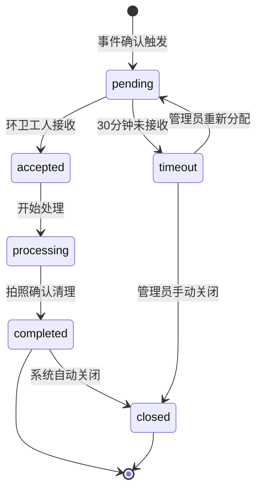

#### 4.5.2 工单服务核心逻辑

```python
class WorkOrderService:

    async def create_from_event(self, event: ViolationEvent) -> WorkOrder:
        """
        从违规事件自动生成工单
        1. 生成工单编号（WO + 日期 + 序号）
        2. 填充位置信息（从摄像头表获取）
        3. 分配给最近的环卫工人（按区域分配策略）
        4. WebSocket 推送通知
        """
        camera = await self.camera_repo.get_by_camera_id(event.camera_id)
        order_no = f"WO{datetime.now().strftime('%Y%m%d')}{await self._get_next_seq()}"

        # 分配策略：按摄像头位置分配给对应区域的环卫工人
        assignee = await self._find_nearest_worker(
            camera.latitude, camera.longitude)

        workorder = await self.workorder_repo.create(
            order_no=order_no,
            event_id=event.event_id,
            assigned_to=assignee.id if assignee else None,
            location_name=camera.location_name,
            latitude=camera.latitude,
            longitude=camera.longitude,
            status="pending"
        )

        # WebSocket 推送工单
        if assignee:
            await self.ws_manager.send_to_user(
                assignee.id, "workorders", {
                    "order_no": order_no,
                    "location": camera.location_name,
                    "event_id": str(event.event_id),
                    "thumbnail_url": event.evidence_frames[0].file_path
                })

        return workorder

    async def accept_workorder(self, order_id: int, user_id: int) -> WorkOrder:
        """环卫工人接收工单"""
        wo = await self.workorder_repo.get_by_id(order_id)
        if not wo or wo.status != "pending":
            raise WorkOrderNotFoundError("工单不存在或状态不可接收")
        if wo.assigned_to and wo.assigned_to != user_id:
            raise PermissionDeniedError("无权操作此工单")

        wo = await self.workorder_repo.update(
            order_id, status="accepted",
            accepted_at=datetime.now())
        return wo

    async def complete_workorder(self, order_id: int, user_id: int,
                                  photo_bytes: bytes) -> WorkOrder:
        """
        环卫工人拍照完成工单
        1. 上传照片至 MinIO
        2. 更新工单状态为 completed
        3. 计算响应时间
        4. 自动关闭工单
        """
        wo = await self.workorder_repo.get_by_id(order_id)
        if not wo or wo.status not in ("accepted", "processing"):
            raise WorkOrderNotFoundError("工单不存在或状态不可完成")

        # 上传照片
        photo_path = await self.evidence_service.upload_workorder_photo(
            order_id, photo_bytes, user_id)

        now = datetime.now()
        response_time = int((now - wo.created_at).total_seconds())

        wo = await self.workorder_repo.update(
            order_id,
            status="completed",
            completed_at=now,
            response_time_sec=response_time)

        # 自动关闭
        wo = await self.workorder_repo.update(
            order_id, status="closed", closed_at=now)

        return wo

    async def check_timeout(self):
        """
        工单超时检查（由 worker 定时任务每 5 分钟调用）
        超过 30 分钟未接收的工单标记为 timeout 并升级推送
        """
        timeout_threshold = datetime.now() - timedelta(minutes=30)
        pending_orders = await self.workorder_repo.get_pending_before(
            timeout_threshold)

        for wo in pending_orders:
            await self.workorder_repo.update(wo.id, status="timeout")
            # 升级推送至管理人员
            managers = await self.user_repo.get_by_role("manager")
            for mgr in managers:
                await self.ws_manager.send_to_user(
                    mgr.id, "workorders", {
                        "type": "timeout_alert",
                        "order_no": wo.order_no,
                        "location": wo.location_name,
                        "message": f"工单 {wo.order_no} 超时未接收"
                    })
```

### 4.6 数据统计模块

**模块职责：** 时序数据写入 InfluxDB、聚合查询、热力图计算。

```python
class StatsService:

    async def record_violation(self, camera_id: str,
                               timestamp: datetime, confidence: float):
        """将违规事件写入 InfluxDB 时序数据库"""
        camera = await self.camera_repo.get_by_camera_id(camera_id)
        area_name = camera.location_name if camera else "unknown"

        point = Point("violation_count") \
            .tag("camera_id", camera_id) \
            .tag("area_name", area_name) \
            .field("count", 1) \
            .field("avg_confidence", confidence) \
            .time(timestamp)
        self.influx_write_api.write(bucket="yanzong", record=point)

    async def get_hourly_stats(self, camera_id: str = None,
                               date: str = None) -> list:
        """
        获取按小时聚合的违规统计
        返回: [{"hour": 0, "count": 5}, {"hour": 1, "count": 3}, ...]
        """
        query = f'''
            SELECT SUM("count") AS "total"
            FROM "violation_count"
            WHERE time >= '{date}T00:00:00+08:00'
              AND time <= '{date}T23:59:59+08:00'
            {f'AND "camera_id" = \'{camera_id}\'' if camera_id else ''}
            GROUP BY time(1h)
        '''
        result = self.influx_query_api.query(query, org="yanzong")
        return [{"hour": i, "count": r.values.get("total", 0)}
                for i, r in enumerate(result)]

    async def get_daily_stats(self, days: int = 7) -> list:
        """
        获取最近 N 天的日级统计
        返回: [{"date": "2026-08-01", "count": 42}, ...]
        """
        query = f'''
            SELECT SUM("count") AS "total"
            FROM "violation_count"
            WHERE time >= now() - {days}d
            GROUP BY time(1d)
        '''
        result = self.influx_query_api.query(query, org="yanzong")
        return [{"date": r.values["_time"].strftime("%Y-%m-%d"),
                 "count": r.values.get("total", 0)}
                for r in result]

    async def compute_heatmap(self, days: int = 7) -> dict:
        """
        核密度估计（KDE）热力图计算
        返回: {"grid": [{"lat": x, "lon": y, "weight": z}, ...],
               "bbox": [min_lat, min_lon, max_lat, max_lon]}
        """
        # 1. 从 PostgreSQL 获取违规事件坐标
        events = await self.event_repo.get_recent_with_location(days)
        if len(events) < 3:
            return {"grid": [], "bbox": None}

        coords = np.array([[e.latitude, e.longitude] for e in events])

        # 2. 计算边界框
        min_lat, min_lon = coords.min(axis=0)
        max_lat, max_lon = coords.max(axis=0)

        # 3. 生成网格
        grid_size = 50
        lat_grid = np.linspace(min_lat, max_lat, grid_size)
        lon_grid = np.linspace(min_lon, max_lon, grid_size)
        grid_points = np.array([(lat, lon)
                                for lat in lat_grid for lon in lon_grid])

        # 4. KDE 计算
        bandwidth = 0.0003  # 约 30 米（经纬度）
        densities = self._kde(grid_points, coords, bandwidth)

        # 5. 格式化输出
        grid = []
        for i, (lat, lon) in enumerate(grid_points):
            if densities[i] > 0.01:
                grid.append({
                    "lat": float(lat),
                    "lon": float(lon),
                    "weight": float(densities[i])
                })

        return {"grid": grid,
                "bbox": [float(min_lat), float(min_lon),
                         float(max_lat), float(max_lon)]}

    def _kde(self, grid_points, data_points, bandwidth):
        """高斯核密度估计"""
        n = len(data_points)
        densities = np.zeros(len(grid_points))
        for i, gp in enumerate(grid_points):
            distances = np.sqrt(np.sum((data_points - gp) ** 2, axis=1))
            weights = np.exp(-0.5 * (distances / bandwidth) ** 2)
            densities[i] = np.sum(weights) / (n * bandwidth * np.sqrt(2 * np.pi))
        # 归一化到 0-1
        if densities.max() > 0:
            densities = densities / densities.max()
        return densities
```

### 4.7 决策引擎模块

**模块职责：** 调度规则引擎，根据频次数据自动生成调度建议。

```python
class DecisionService:

    def __init__(self, stats_service, suggestion_repo):
        self.stats = stats_service
        self.repo = suggestion_repo
        self.rules = [
            self._rule_add_facility,
            self._rule_adjust_schedule,
            self._rule_treatment_effective,
            self._rule_warning,
        ]

    async def check_and_generate_suggestion(self, event: ViolationEvent):
        """
        每次违规事件后触发规则检查
        由 EventService._trigger_post_event_flow 调用
        """
        for rule_fn in self.rules:
            suggestion = await rule_fn(event)
            if suggestion:
                await self.repo.create(suggestion)
                # WebSocket 推送建议卡片
                await self.ws_manager.broadcast("alerts", {
                    "type": "suggestion",
                    "suggestion": suggestion
                })

    async def _rule_add_facility(self, event) -> Optional[dict]:
        """
        规则1: 某区域频次 > 阈值 × 1.5
        动作: 生成"增设设施"建议
        """
        camera = await self.camera_repo.get_by_camera_id(event.camera_id)
        area = camera.location_name

        # 获取近 7 天该区域频次
        area_events = await self.event_repo.count_by_area(area, days=7)
        avg_events = await self.event_repo.avg_by_area_last_30_days(area)

        threshold = avg_events * 1.5
        if area_events > threshold and area_events > 5:
            # 检查是否已有未处理的同类建议
            existing = await self.repo.get_pending_by_area_and_type(
                area, "add_facility")
            if existing:
                return None  # 已有建议，不重复生成

            pct = int((area_events - avg_events) / avg_events * 100) if avg_events > 0 else 0
            return {
                "type": "add_facility",
                "area_name": area,
                "content": f"建议在 {area} 附近增设烟蒂收集器，"
                          f"该区域近 7 天违规频次 {area_events} 次，"
                          f"超出平均值 {pct}%",
                "frequency_data": {
                    "area": area,
                    "recent_count": area_events,
                    "avg_count": avg_events
                }
            }
        return None

    async def _rule_adjust_schedule(self, event) -> Optional[dict]:
        """
        规则2: 某时段频次 > 阈值 × 1.5
        动作: 生成"调整排班"建议
        """
        hour = event.event_timestamp.hour
        hour_str = f"{hour:02d}:00-{hour+1:02d}:00"

        # 获取近 7 天该时段频次
        hour_events = await self.event_repo.count_by_hour(hour, days=7)
        avg_hour = await self.event_repo.avg_hourly_last_30_days(hour)
        daily_total = await self.event_repo.count_total(days=7)

        threshold = avg_hour * 1.5
        if hour_events > threshold and hour_events > 3:
            existing = await self.repo.get_pending_by_time_and_type(
                hour_str, "adjust_schedule")
            if existing:
                return None

            pct = int(hour_events / daily_total * 100) if daily_total > 0 else 0
            return {
                "type": "adjust_schedule",
                "time_range": hour_str,
                "content": f"建议在 {hour_str} 增派巡查人员，"
                          f"该时段近 7 天违规频次 {hour_events} 次，"
                          f"占全天 {pct}%",
                "frequency_data": {
                    "hour": hour,
                    "recent_count": hour_events,
                    "avg_count": avg_hour,
                    "daily_total": daily_total
                }
            }
        return None

    async def _rule_treatment_effective(self, event) -> Optional[dict]:
        """
        规则3: 连续 N 天频次下降 > 30%
        动作: 生成"治理有效"报告
        """
        camera = await self.camera_repo.get_by_camera_id(event.camera_id)
        area = camera.location_name

        # 检查是否有已采纳的 add_facility 建议
        accepted = await self.repo.get_accepted_by_area_and_type(
            area, "add_facility")
        if not accepted:
            return None

        # 对比采纳前后 7 天的频次
        post_adoption = await self.event_repo.count_by_area_after_date(
            area, accepted.resolved_at, days=7)
        pre_adoption = await self.event_repo.count_by_area_before_date(
            area, accepted.resolved_at, days=7)

        if pre_adoption > 0:
            decline = (pre_adoption - post_adoption) / pre_adoption
            if decline > 0.3:
                return {
                    "type": "treatment_effective",
                    "area_name": area,
                    "content": f"{area} 治理措施生效，"
                              f"违规频次已下降 {int(decline * 100)}%，"
                              f"建议保持当前方案",
                    "frequency_data": {
                        "pre_count": pre_adoption,
                        "post_count": post_adoption,
                        "decline_rate": decline
                    }
                }
        return None

    async def _rule_warning(self, event) -> Optional[dict]:
        """
        规则4: 连续 N 天频次上升 > 30%
        动作: 生成"预警"通知
        """
        camera = await self.camera_repo.get_by_camera_id(event.camera_id)
        area = camera.location_name

        recent_3d = await self.event_repo.count_by_area(area, days=3)
        previous_3d = await self.event_repo.count_by_area_range(
            area, days_end=3, days_start=6)

        if previous_3d > 0:
            increase = (recent_3d - previous_3d) / previous_3d
            if increase > 0.3:
                return {
                    "type": "warning",
                    "area_name": area,
                    "content": f"{area} 违规频次持续上升，"
                              f"近 3 天较前 3 天增长 {int(increase * 100)}%，"
                              f"建议加强巡查或分析原因",
                    "frequency_data": {
                        "recent_count": recent_3d,
                        "previous_count": previous_3d,
                        "increase_rate": increase
                    }
                }
        return None
```

### 4.8 WebSocket 推送模块

**模块职责：** 管理 WebSocket 连接，按频道和用户推送实时消息。

```python
class WebSocketManager:
    """
    WebSocket 连接管理器
    支持频道广播和定向用户推送
    """

    def __init__(self):
        # {channel: {user_id: websocket}}
        self.connections: dict[str, dict[int, WebSocket]] = {
            "alerts": {},
            "camera-status": {},
            "workorders": {},
            "system-metrics": {},
        }

    async def connect(self, websocket: WebSocket, channel: str, user_id: int):
        """客户端连接"""
        await websocket.accept()
        if channel not in self.connections:
            self.connections[channel] = {}
        self.connections[channel][user_id] = websocket

    async def disconnect(self, channel: str, user_id: int):
        """客户端断开"""
        if channel in self.connections:
            self.connections[channel].pop(user_id, None)

    async def broadcast(self, channel: str, message: dict):
        """向频道所有客户端广播"""
        if channel not in self.connections:
            return
        dead = []
        for uid, ws in self.connections[channel].items():
            try:
                await ws.send_json(message)
            except Exception:
                dead.append(uid)
        for uid in dead:
            self.connections[channel].pop(uid, None)

    async def send_to_user(self, user_id: int, channel: str, message: dict):
        """向特定用户推送消息"""
        ws = self.connections.get(channel, {}).get(user_id)
        if ws:
            try:
                await ws.send_json(message)
            except Exception:
                await self.disconnect(channel, user_id)
```

### 4.9 审计日志模块

**模块职责：** 记录所有写操作日志，支持查询和导出。

```python
class AuditService:

    async def log(self, user_id: int, action: str, resource_type: str,
                  resource_id: str, detail: dict, ip_address: str):
        """记录操作日志（由中间件自动调用）"""
        await self.audit_repo.create(
            user_id=user_id,
            action=action,
            resource_type=resource_type,
            resource_id=resource_id,
            detail=detail,
            ip_address=ip_address
        )

    async def query_logs(self, filters: dict, page: int = 1,
                         size: int = 50) -> dict:
        """
        查询操作日志
        支持按用户、操作类型、资源类型、时间范围筛选
        返回: {"items": [...], "total": 100, "page": 1, "size": 50}
        """
        return await self.audit_repo.query(filters, page, size)
```

---

## 5. 前端应用功能设计

### 5.1 实时监控大屏

#### 5.1.1 组件设计

```typescript
// views/monitor/index.vue - 主容器
interface MonitorViewState {
  layout: '2x2' | '1x3' | '1x4';     // 视频矩阵布局
  cameras: CameraStream[];            // 当前显示的摄像头列表
  aiOverlay: boolean;                 // AI 渲染开关
  alerts: AlertPopup[];               // 当前显示的报警弹窗队列
}

interface CameraStream {
  camera_id: string;
  name: string;
  stream_url: string;                 // 签名后的流地址
  status: 'online' | 'offline' | 'degraded';
  fps: number;
  ai_overlay_data: {                  // AI 渲染叠加数据
    detections: Detection[];
    trajectories: Trajectory[];
    stage_labels: string[];
  };
}

interface AlertPopup {
  event_id: string;
  camera_id: string;
  camera_name: string;
  timestamp: string;
  confidence: number;
  thumbnail_url: string;
  auto_dismiss_sec: number;          // 自动消失时间（默认 10 秒）
}
```

#### 5.1.2 关键交互逻辑

```typescript
// composables/useWebSocket.ts
function useMonitorWebSocket() {
  const ws = ref<WebSocket | null>(null);
  const alerts = ref<AlertPopup[]>([]);

  function connect() {
    const token = useAuthStore().token;
    ws.value = new WebSocket(`wss://api/ws/alerts?token=${token}`);

    ws.value.onmessage = (event) => {
      const data = JSON.parse(event.data);
      switch (data.type) {
        case 'alert':
          // 添加报警弹窗，最多同时显示 3 个
          alerts.value.push(data);
          if (alerts.value.length > 3) {
            alerts.value.shift();
          }
          // 10 秒后自动消失
          setTimeout(() => removeAlert(data.event_id), 10000);
          break;
        case 'camera_status':
          updateCameraStatus(data);
          break;
      }
    };

    ws.value.onclose = () => {
      // 3 秒后自动重连
      setTimeout(connect, 3000);
    };
  }

  return { alerts, connect };
}
```

### 5.2 证据追溯面板

#### 5.2.1 页面结构

```typescript
// views/trace/index.vue
interface TraceViewState {
  events: ViolationEvent[];           // 事件列表（分页）
  selectedEvent: ViolationEvent | null;
  filters: {
    date_range: [string, string];
    camera_id: string | null;
    min_confidence: number;
  };
  evidenceUrls: {
    video_clip: string;
    holding_frame: string;
    throwing_frame: string;
    landed_frame: string;
  } | null;
  timeline: TimelineNode[];           // 证据链时间轴
}

interface TimelineNode {
  stage: 'HOLDING' | 'THROWING' | 'LANDED' | 'CONFIRMED';
  timestamp: string;
  description: string;
  frame_url?: string;
}

interface TrajectoryPoint {
  x: number;
  y: number;
  timestamp: string;
  type: 'person' | 'cigarette';     // 行人轨迹 or 烟头轨迹
}
```

#### 5.2.2 轨迹可视化组件

```typescript
// views/trace/TrajectoryView.vue
/*
 * 在视频画面上叠加轨迹：
 * - 行人轨迹：蓝色折线，标注 track_id
 * - 烟头轨迹：红色抛物线，标注关键时间点
 * - 检测框：实时绘制 cigarette/hand bbox
 */
function drawTrajectory(canvas: HTMLCanvasElement,
                        videoFrame: HTMLVideoElement,
                        trajectory: TrajectoryPoint[],
                        detections: Detection[]) {
  const ctx = canvas.getContext('2d');
  ctx.clearRect(0, 0, canvas.width, canvas.height);

  // 绘制行人轨迹（蓝色折线）
  const personPoints = trajectory.filter(p => p.type === 'person');
  if (personPoints.length > 1) {
    ctx.strokeStyle = '#0066FF';
    ctx.lineWidth = 2;
    ctx.beginPath();
    ctx.moveTo(personPoints[0].x, personPoints[0].y);
    personPoints.slice(1).forEach(p => ctx.lineTo(p.x, p.y));
    ctx.stroke();
  }

  // 绘制烟头轨迹（红色抛物线）
  const cigPoints = trajectory.filter(p => p.type === 'cigarette');
  if (cigPoints.length > 1) {
    ctx.strokeStyle = '#FF3300';
    ctx.lineWidth = 2;
    ctx.setLineDash([5, 3]);
    ctx.beginPath();
    ctx.moveTo(cigPoints[0].x, cigPoints[0].y);
    cigPoints.slice(1).forEach(p => ctx.lineTo(p.x, p.y));
    ctx.stroke();
    ctx.setLineDash([]);
  }

  // 绘制检测框
  detections.forEach(d => {
    ctx.strokeStyle = d.class === 'cigarette' ? '#FF0000' : '#00FF00';
    ctx.lineWidth = 1;
    ctx.strokeRect(d.bbox[0], d.bbox[1], d.bbox[2], d.bbox[3]);
    ctx.fillStyle = ctx.strokeStyle;
    ctx.fillText(`${d.class} ${d.confidence.toFixed(2)}`,
                 d.bbox[0], d.bbox[1] - 5);
  });
}
```

### 5.3 决策驾驶舱

#### 5.3.1 GIS 热力图组件

```typescript
// views/dashboard/HeatmapView.vue
/*
 * 基于 Leaflet 渲染校园地图 + 违规事件热力图
 * - 底图：校园卫星图或平面图
 * - 热力图层：使用 leaflet.heat 插件
 * - 交互：点击热区弹出该区域事件列表
 */
interface HeatmapConfig {
  radius: number;          // 热力点半径（像素）
  maxOpacity: number;      // 最大透明度
  scaleRadius: boolean;    // 是否随缩放缩放
  gradient: {              // 颜色渐变
    0.0: '#00FF00',        // 绿色（低频）
    0.5: '#FFFF00',        // 黄色（中频）
    1.0: '#FF0000',        // 红色（高频）
  };
}

function renderHeatmap(map: L.Map, gridData: HeatmapGrid) {
  const points = gridData.grid.map(g => [
    g.lat, g.lon, g.weight
  ]);
  L.heatLayer(points, {
    radius: 25,
    maxOpacity: 0.8,
    scaleRadius: true,
    gradient: { 0.0: '#00FF00', 0.5: '#FFFF00', 1.0: '#FF0000' }
  }).addTo(map);
}
```

### 5.4 移动端小程序

#### 5.4.1 页面与交互

```typescript
// 小程序页面结构
pages/
├── index/              // 首页：工单概览 + 消息通知
├── workorder/
│   ├── list/          // 工单列表（待处理/进行中/已完成）
│   ├── detail/        // 工单详情（位置地图 + 证据缩略图）
│   └── complete/      // 完成工单（拍照 + 提交）
├── patrol/            // 巡查打卡
└── profile/           // 个人中心

// 工单详情页关键逻辑
Page({
  data: {
    workorder: null,
    evidenceUrls: {},
    distance: null,        // 当前位置到工单位置的距离
  },

  onLoad(options) {
    this.loadWorkorder(options.id);
    this.startLocationTracking();
  },

  async loadWorkorder(id) {
    const res = await api.getWorkorder(id);
    // 获取证据文件签名 URL
    const evidence = await api.getEventEvidence(res.event_id);
    this.setData({ workorder: res, evidenceUrls: evidence });
  },

  startLocationTracking() {
    // 实时计算环卫工人到工单位置的距离
    wx.getLocation({
      type: 'gcj02',
      success: (res) => {
        const dist = calcDistance(
          res.latitude, res.longitude,
          this.data.workorder.latitude, this.data.workorder.longitude
        );
        this.setData({ distance: Math.round(dist) });
      }
    });
  },

  async onComplete() {
    // 拍照闭环
    wx.chooseImage({
      count: 1,
      sourceType: 'camera',
      success: async (res) => {
        const photo = res.tempFilePaths[0];
        wx.showLoading({ title: '提交中...' });
        await api.completeWorkorder(this.data.workorder.id, photo);
        wx.hideLoading();
        wx.showToast({ title: '已完成', icon: 'success' });
        wx.navigateBack();
      }
    });
  }
});
```

---

## 6. 数据模型设计

### 6.1 ER 图

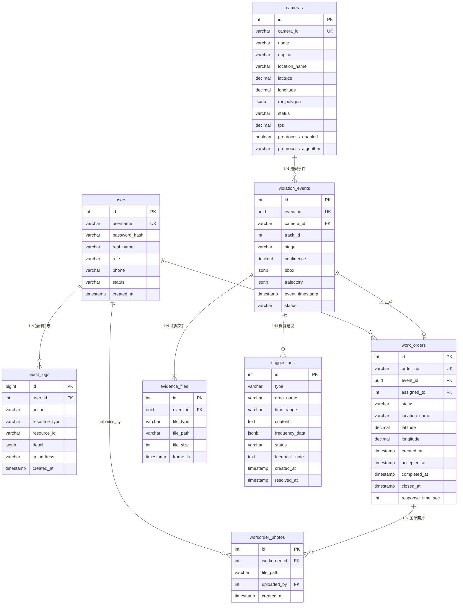

### 6.2 建表 SQL

```sql
-- 用户表
CREATE TABLE users (
    id SERIAL PRIMARY KEY,
    username VARCHAR(50) UNIQUE NOT NULL,
    password_hash VARCHAR(255) NOT NULL,
    real_name VARCHAR(50) NOT NULL,
    role VARCHAR(20) NOT NULL CHECK (role IN ('admin', 'manager', 'worker', 'ai_dev')),
    phone VARCHAR(20),
    avatar_url VARCHAR(255),
    status VARCHAR(10) DEFAULT 'active' CHECK (status IN ('active', 'disabled')),
    created_at TIMESTAMP DEFAULT CURRENT_TIMESTAMP,
    updated_at TIMESTAMP DEFAULT CURRENT_TIMESTAMP
);

-- 摄像头表
CREATE TABLE cameras (
    id SERIAL PRIMARY KEY,
    camera_id VARCHAR(20) UNIQUE NOT NULL,
    name VARCHAR(100) NOT NULL,
    rtsp_url VARCHAR(500) NOT NULL,
    location_name VARCHAR(100) NOT NULL,
    latitude DECIMAL(10,7),
    longitude DECIMAL(10,7),
    roi_polygon JSONB,
    status VARCHAR(10) DEFAULT 'offline' CHECK (status IN ('online', 'offline', 'degraded')),
    fps DECIMAL(5,2),
    preprocess_enabled BOOLEAN DEFAULT FALSE,
    preprocess_algorithm VARCHAR(20) CHECK (preprocess_algorithm IN ('retinex', 'histogram_eq')),
    created_at TIMESTAMP DEFAULT CURRENT_TIMESTAMP,
    updated_at TIMESTAMP DEFAULT CURRENT_TIMESTAMP
);

-- 违规事件表
CREATE TABLE violation_events (
    id SERIAL PRIMARY KEY,
    event_id UUID UNIQUE NOT NULL,
    camera_id VARCHAR(20) NOT NULL REFERENCES cameras(camera_id),
    track_id INT,
    stage VARCHAR(20) NOT NULL,
    confidence DECIMAL(4,3) NOT NULL,
    bbox JSONB,
    trajectory JSONB,
    event_timestamp TIMESTAMP NOT NULL,
    status VARCHAR(20) DEFAULT 'confirmed' CHECK (status IN ('confirmed', 'false_alarm', 'pending_review', 'low_confidence', 'invalid')),
    created_at TIMESTAMP DEFAULT CURRENT_TIMESTAMP
);
CREATE INDEX idx_events_camera ON violation_events(camera_id);
CREATE INDEX idx_events_timestamp ON violation_events(event_timestamp);
CREATE INDEX idx_events_status ON violation_events(status);

-- 证据文件表
CREATE TABLE evidence_files (
    id SERIAL PRIMARY KEY,
    event_id UUID NOT NULL REFERENCES violation_events(event_id),
    file_type VARCHAR(20) NOT NULL CHECK (file_type IN ('video_clip', 'holding_frame', 'throwing_frame', 'landed_frame')),
    file_path VARCHAR(500) NOT NULL,
    file_size INT,
    frame_ts TIMESTAMP,
    created_at TIMESTAMP DEFAULT CURRENT_TIMESTAMP
);
CREATE INDEX idx_evidence_event ON evidence_files(event_id);

-- 工单表
CREATE TABLE work_orders (
    id SERIAL PRIMARY KEY,
    order_no VARCHAR(30) UNIQUE NOT NULL,
    event_id UUID NOT NULL REFERENCES violation_events(event_id),
    assigned_to INT REFERENCES users(id),
    status VARCHAR(20) DEFAULT 'pending' CHECK (status IN ('pending', 'accepted', 'processing', 'completed', 'closed', 'timeout')),
    location_name VARCHAR(100) NOT NULL,
    latitude DECIMAL(10,7),
    longitude DECIMAL(10,7),
    created_at TIMESTAMP DEFAULT CURRENT_TIMESTAMP,
    accepted_at TIMESTAMP,
    completed_at TIMESTAMP,
    closed_at TIMESTAMP,
    response_time_sec INT
);
CREATE INDEX idx_workorder_status ON work_orders(status);
CREATE INDEX idx_workorder_assignee ON work_orders(assigned_to);

-- 工单照片表
CREATE TABLE workorder_photos (
    id SERIAL PRIMARY KEY,
    workorder_id INT NOT NULL REFERENCES work_orders(id),
    file_path VARCHAR(500) NOT NULL,
    uploaded_by INT NOT NULL REFERENCES users(id),
    created_at TIMESTAMP DEFAULT CURRENT_TIMESTAMP
);

-- 调度建议表
CREATE TABLE suggestions (
    id SERIAL PRIMARY KEY,
    type VARCHAR(30) NOT NULL CHECK (type IN ('add_facility', 'adjust_schedule', 'treatment_effective', 'warning')),
    area_name VARCHAR(100),
    time_range VARCHAR(50),
    content TEXT NOT NULL,
    frequency_data JSONB,
    status VARCHAR(20) DEFAULT 'pending' CHECK (status IN ('pending', 'accepted', 'rejected', 'expired')),
    feedback_note TEXT,
    created_at TIMESTAMP DEFAULT CURRENT_TIMESTAMP,
    resolved_at TIMESTAMP
);

-- 审计日志表
CREATE TABLE audit_logs (
    id BIGSERIAL PRIMARY KEY,
    user_id INT REFERENCES users(id),
    action VARCHAR(50) NOT NULL,
    resource_type VARCHAR(50),
    resource_id VARCHAR(50),
    detail JSONB,
    ip_address VARCHAR(45),
    created_at TIMESTAMP DEFAULT CURRENT_TIMESTAMP
);
CREATE INDEX idx_audit_user ON audit_logs(user_id);
CREATE INDEX idx_audit_created ON audit_logs(created_at);
```

---

## 7. 核心业务流程

### 7.1 违规事件全链路流程

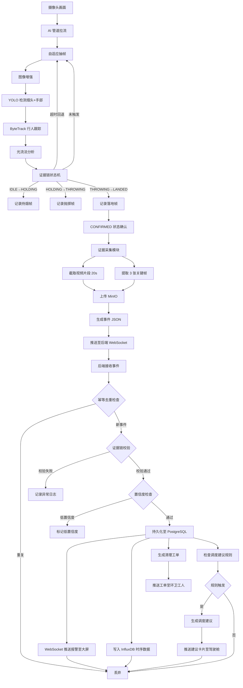

### 7.2 工单闭环流程

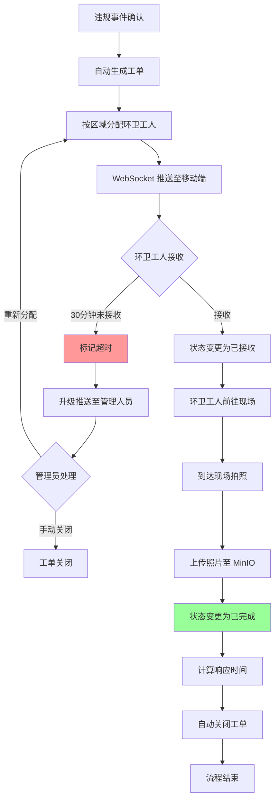

### 7.3 调度建议生成流程

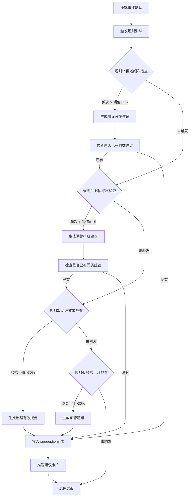

### 7.4 AI 参数动态调优流程

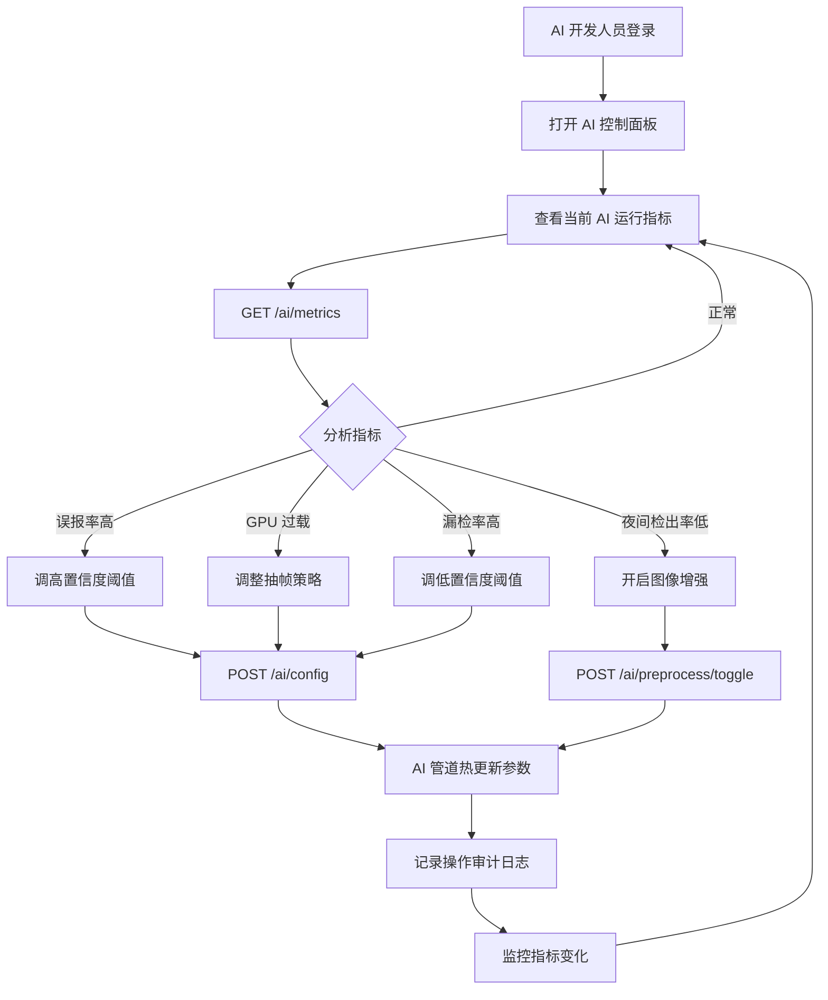

---

## 8. 关键时序图

### 8.1 违规事件处理时序

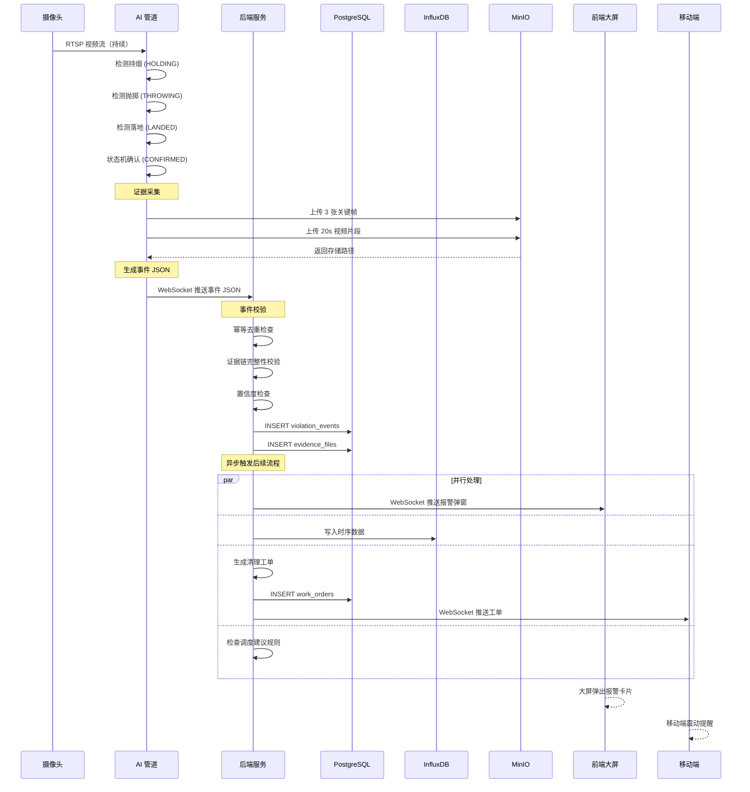

### 8.2 工单推送与闭环时序

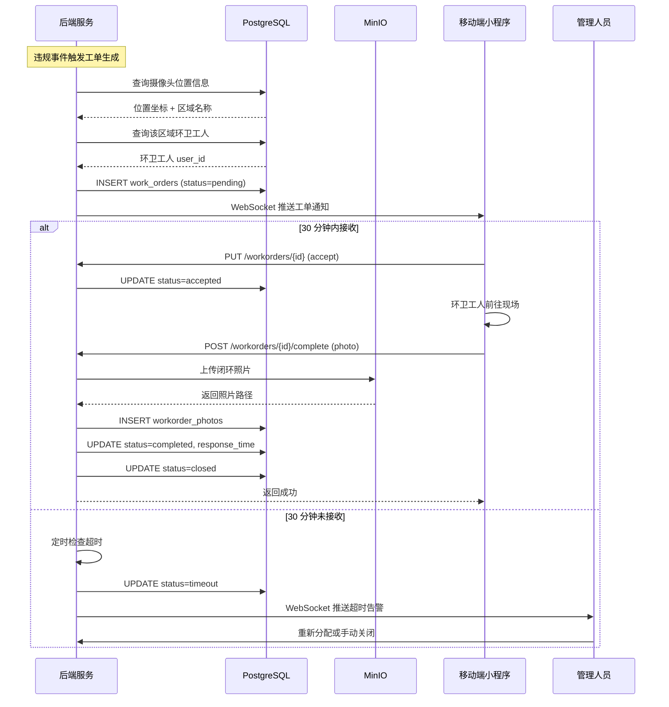

### 8.3 实时报警推送时序

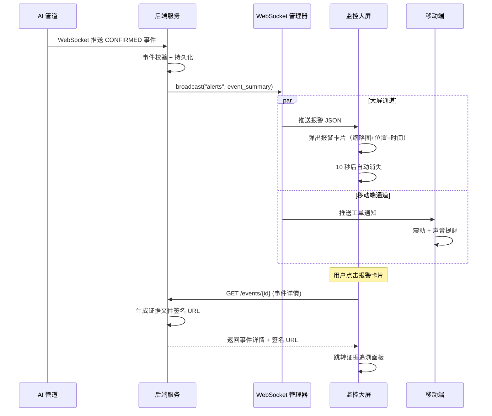

### 8.4 视频流鉴权时序

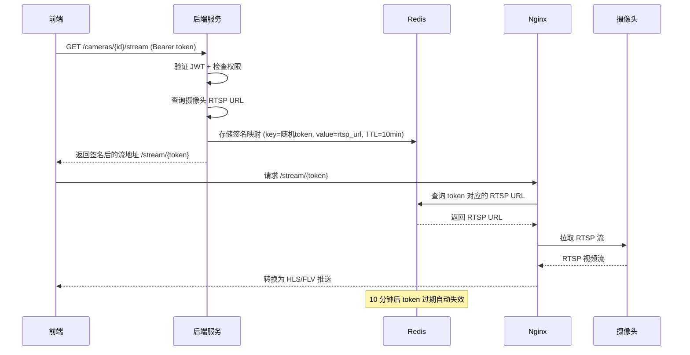

---

## 9. 接口详细设计

### 9.1 认证接口

#### POST /api/v1/auth/login

**描述：** 用户登录，获取 JWT Token

**请求体：**
```json
{
  "username": "admin",
  "password": "xxx"
}
```

**响应 200：**
```json
{
  "access_token": "eyJhbGci...",
  "refresh_token": "eyJhbGci...",
  "token_type": "bearer",
  "expires_in": 7200
}
```

**响应 401：**
```json
{
  "error_code": "INVALID_CREDENTIALS",
  "message": "用户名或密码错误"
}
```

#### POST /api/v1/auth/refresh

**请求体：**
```json
{
  "refresh_token": "eyJhbGci..."
}
```

**响应 200：** 同 login 响应

### 9.2 摄像头接口

#### GET /api/v1/cameras

**查询参数：**

| 参数 | 类型 | 默认 | 说明 |
|------|------|------|------|
| page | int | 1 | 页码 |
| size | int | 20 | 每页条数 |
| status | string | - | 按状态筛选 |

**响应 200：**
```json
{
  "items": [
    {
      "id": 1,
      "camera_id": "cam_001",
      "name": "教学楼A出口",
      "location_name": "教学楼A",
      "latitude": 32.1265,
      "longitude": 114.0673,
      "status": "online",
      "fps": 25.0
    }
  ],
  "total": 4,
  "page": 1,
  "size": 20
}
```

#### POST /api/v1/cameras

**请求体：**
```json
{
  "camera_id": "cam_005",
  "name": "图书馆入口",
  "rtsp_url": "rtsp://192.168.1.100:554/stream1",
  "location_name": "图书馆",
  "latitude": 32.1268,
  "longitude": 114.0680,
  "roi_polygon": [[100,100],[800,100],[800,600],[100,600]]
}
```

**响应 201：** 返回创建的摄像头对象

**响应 409：**
```json
{
  "error_code": "DUPLICATE_CAMERA",
  "message": "摄像头 cam_005 已存在"
}
```

### 9.3 事件接口

#### GET /api/v1/events

**查询参数：**

| 参数 | 类型 | 说明 |
|------|------|------|
| page | int | 页码 |
| size | int | 每页条数 |
| camera_id | string | 按摄像头筛选 |
| start_date | string | 起始日期 (YYYY-MM-DD) |
| end_date | string | 结束日期 |
| min_confidence | float | 最低置信度 |
| status | string | 事件状态 |

**响应 200：**
```json
{
  "items": [
    {
      "event_id": "a1b2c3d4-...",
      "camera_id": "cam_003",
      "track_id": 1847,
      "confidence": 0.92,
      "event_timestamp": "2026-08-07T22:10:35",
      "status": "confirmed",
      "evidence_count": 4,
      "has_workorder": true
    }
  ],
  "total": 156,
  "page": 1,
  "size": 20
}
```

#### GET /api/v1/events/{event_id}

**响应 200：**
```json
{
  "event_id": "a1b2c3d4-...",
  "camera_id": "cam_003",
  "camera_name": "教学楼B出口",
  "track_id": 1847,
  "stage": "THROW_CONFIRMED",
  "confidence": 0.92,
  "bbox": [120, 340, 25, 18],
  "trajectory": [[115,335,"2026-08-07T22:10:33"],[118,338,"..."]],
  "event_timestamp": "2026-08-07T22:10:35",
  "status": "confirmed",
  "evidence": {
    "video_clip": "https://minio.../signed-url...",
    "frames": {
      "holding": "https://minio.../signed-url...",
      "throwing": "https://minio.../signed-url...",
      "landed": "https://minio.../signed-url..."
    }
  },
  "workorder": {
    "order_no": "WO20260807001",
    "status": "completed"
  }
}
```

#### GET /api/v1/events/heatmap

**查询参数：**

| 参数 | 类型 | 默认 | 说明 |
|------|------|------|------|
| days | int | 7 | 统计天数 |

**响应 200：**
```json
{
  "grid": [
    {"lat": 32.1265, "lon": 114.0673, "weight": 0.85},
    {"lat": 32.1266, "lon": 114.0674, "weight": 0.62}
  ],
  "bbox": [32.1260, 114.0670, 32.1270, 114.0680]
}
```

### 9.4 工单接口

#### GET /api/v1/workorders

**查询参数：**

| 参数 | 类型 | 说明 |
|------|------|------|
| page, size | int | 分页 |
| status | string | 按状态筛选 |
| assigned_to | int | 按分配人筛选 |

#### POST /api/v1/workorders/{id}/complete

**请求体（multipart/form-data）：**

| 字段 | 类型 | 说明 |
|------|------|------|
| photo | file | 闭环照片（JPEG，≤10MB） |

**响应 200：**
```json
{
  "id": 42,
  "order_no": "WO20260807001",
  "status": "closed",
  "completed_at": "2026-08-07T22:25:00",
  "response_time_sec": 892
}
```

### 9.5 决策接口

#### GET /api/v1/suggestions

**响应 200：**
```json
{
  "items": [
    {
      "id": 5,
      "type": "add_facility",
      "area_name": "教学楼B出口",
      "content": "建议在教学楼B出口附近增设烟蒂收集器...",
      "frequency_data": {
        "recent_count": 18,
        "avg_count": 8
      },
      "status": "pending",
      "created_at": "2026-08-06T10:00:00"
    }
  ]
}
```

#### POST /api/v1/suggestions/{id}/feedback

**请求体：**
```json
{
  "action": "accepted",
  "note": "已安排采购烟蒂收集器"
}
```

**响应 200：**
```json
{
  "id": 5,
  "status": "accepted",
  "feedback_note": "已安排采购烟蒂收集器",
  "resolved_at": "2026-08-07T15:30:00"
}
```

### 9.6 AI 控制接口

#### POST /ai/config

**请求体：**
```json
{
  "camera_id": "cam_003",
  "confidence_threshold": 0.80,
  "state_machine_params": {
    "holding_iou_threshold": 0.3,
    "holding_min_frames": 5,
    "throwing_velocity_threshold": 50.0,
    "trajectory_fit_threshold": 0.85,
    "landed_min_static_frames": 30
  },
  "roi": {
    "enabled": true,
    "polygon": [[100,100],[800,100],[800,600],[100,600]]
  }
}
```

**响应 200：**
```json
{
  "status": "ok",
  "applied_config": {
    "camera_id": "cam_003",
    "confidence_threshold": 0.80,
    "updated_at": "2026-08-07T22:15:00"
  }
}
```

#### POST /ai/preprocess/toggle

**请求体：**
```json
{
  "camera_id": "cam_003",
  "enabled": true,
  "algorithm": "retinex",
  "auto_mode": false
}
```

**响应 200：**
```json
{
  "status": "ok",
  "camera_id": "cam_003",
  "preprocess_enabled": true,
  "algorithm": "retinex",
  "updated_at": "2026-08-07T22:15:00"
}
```

#### GET /ai/metrics

**响应 200：**
```json
{
  "cameras": [
    {
      "camera_id": "cam_003",
      "status": "online",
      "current_fps": 25.0,
      "gpu_memory_used_mb": 3200,
      "gpu_memory_total_mb": 24576,
      "inference_queue_length": 12,
      "preprocess_enabled": false,
      "dropped_frames": 0,
      "avg_inference_ms": 38.5
    }
  ],
  "gpu_summary": {
    "device": "NVIDIA RTX 3090",
    "utilization": 0.72,
    "memory_used_mb": 7300,
    "memory_total_mb": 24576,
    "temperature_c": 68
  }
}
```

### 9.7 用户接口

#### POST /api/v1/users

**请求体：**
```json
{
  "username": "worker01",
  "password": "xxx",
  "real_name": "张三",
  "role": "worker",
  "phone": "13800138000"
}
```

**响应 201：** 返回创建的用户对象（不含 password_hash）

#### GET /api/v1/audit/logs

**查询参数：**

| 参数 | 类型 | 说明 |
|------|------|------|
| page, size | int | 分页 |
| user_id | int | 按操作人筛选 |
| action | string | 按操作类型筛选 |
| start_date | string | 起始日期 |
| end_date | string | 结束日期 |

---

## 10. 错误码设计

### 10.1 错误码规范

错误码格式：`MODULE_ERROR_TYPE`

| 模块前缀 | 说明 |
|----------|------|
| AUTH | 认证模块 |
| CAM | 摄像头模块 |
| EVT | 事件模块 |
| WO | 工单模块 |
| DEC | 决策模块 |
| AI | AI 控制模块 |
| SYS | 系统级错误 |

### 10.2 错误码清单

| 错误码 | HTTP 状态码 | 说明 |
|--------|------------|------|
| AUTH_INVALID_CREDENTIALS | 401 | 用户名或密码错误 |
| AUTH_TOKEN_EXPIRED | 401 | Token 已过期 |
| AUTH_TOKEN_INVALID | 401 | Token 无效 |
| AUTH_ACCOUNT_DISABLED | 403 | 账户已禁用 |
| AUTH_PERMISSION_DENIED | 403 | 无权限执行此操作 |
| CAM_NOT_FOUND | 404 | 摄像头不存在 |
| CAM_DUPLICATE | 409 | 摄像头已存在 |
| CAM_OFFLINE | 503 | 摄像头离线 |
| EVT_NOT_FOUND | 404 | 事件不存在 |
| EVT_VALIDATION_FAILED | 422 | 事件证据链校验失败 |
| EVT_DUPLICATE | 409 | 重复事件 |
| WO_NOT_FOUND | 404 | 工单不存在 |
| WO_INVALID_STATUS | 422 | 工单状态不可操作 |
| WO_TIMEOUT | 408 | 工单超时 |
| DEC_SUGGESTION_NOT_FOUND | 404 | 建议不存在 |
| AI_CONFIG_INVALID | 422 | AI 配置参数无效 |
| AI_PIPELINE_OFFLINE | 503 | AI 管道离线 |
| SYS_INTERNAL_ERROR | 500 | 内部服务器错误 |
| SYS_RATE_LIMITED | 429 | 请求过于频繁 |
| SYS_FILE_TOO_LARGE | 413 | 文件超过大小限制 |

### 10.3 统一错误响应格式

```json
{
  "error_code": "AUTH_INVALID_CREDENTIALS",
  "message": "用户名或密码错误",
  "detail": "请检查用户名和密码后重试",
  "timestamp": "2026-08-07T22:30:00+08:00"
}
```

---

*文档结束*
